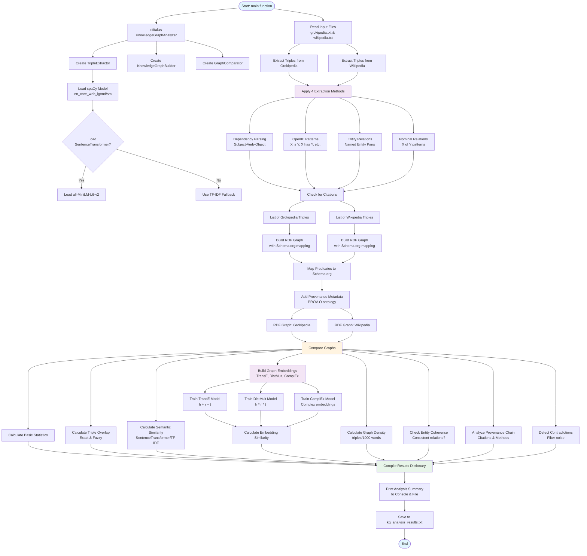
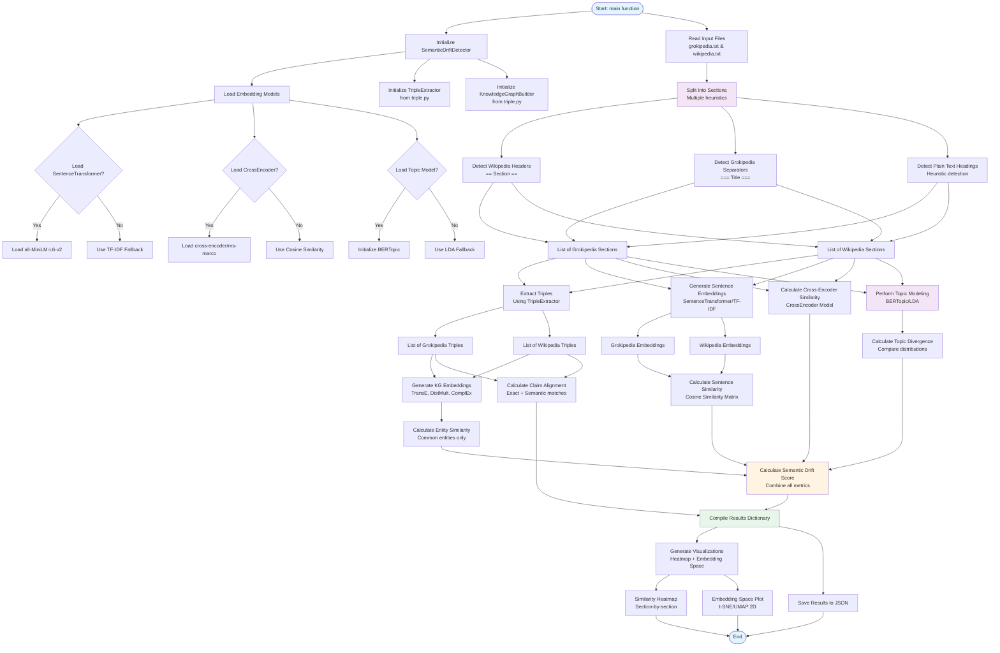
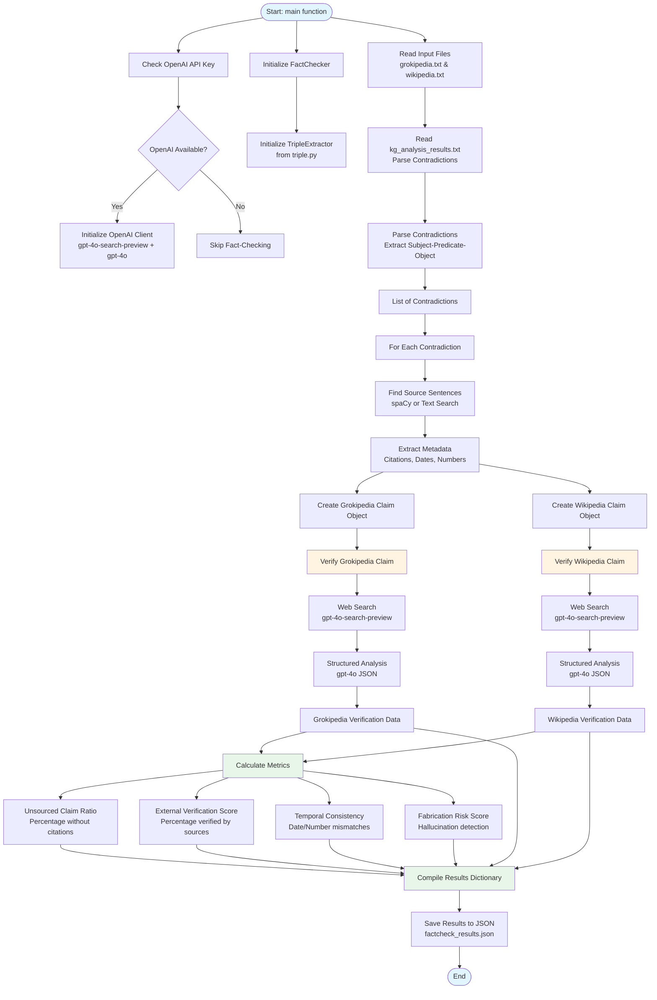
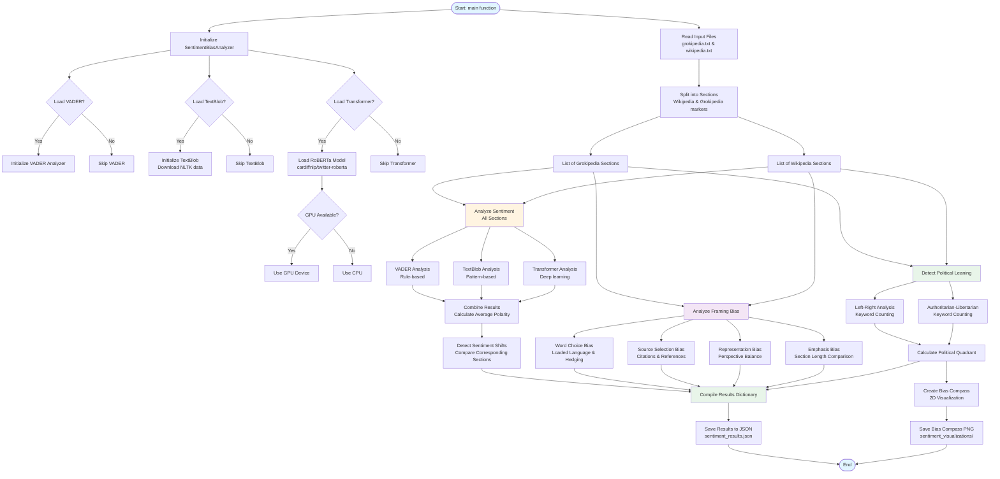
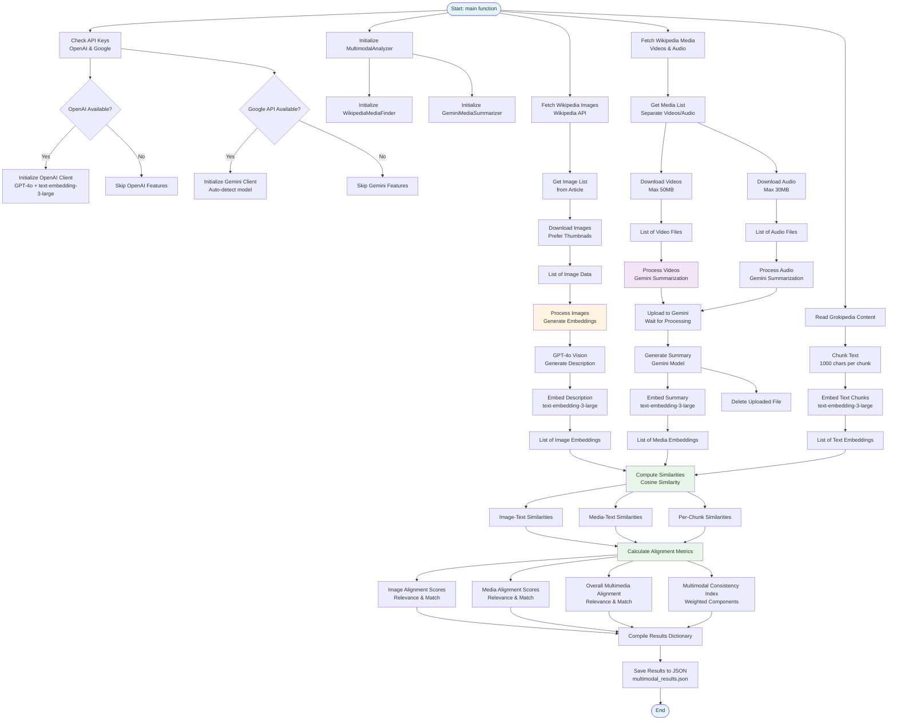
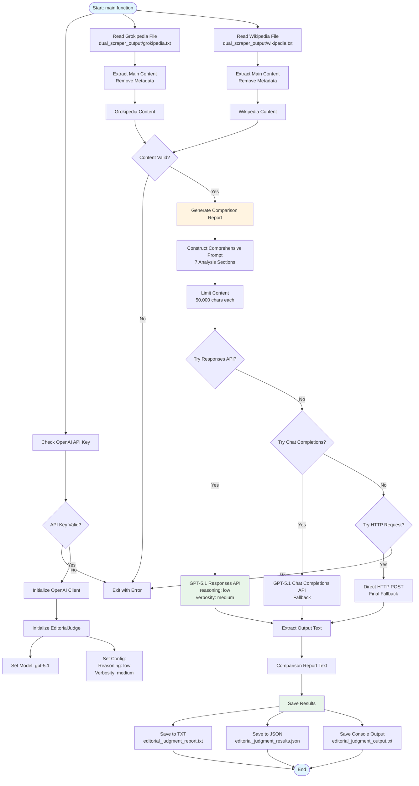

# DKGPedia - A Better Grokipedia

> **Decentralized Knowledge Graph-powered platform for accurate, hallucination-free information retrieval**


DKGPedia is a platform that leverages the OriginTrail Decentralized Knowledge Graph (DKG) to provide users with accurate, verified information free from AI hallucinations. By combining AI-powered analysis, blockchain-based verification, and decentralized storage, DKGPedia creates a trusted knowledge ecosystem where contributors are incentivized to provide high-quality, verifiable data.

---

## 🔗 Important Links

### Deployed Services
- **Deployed DKG Node**: [https://8a7ad71b6b20.ngrok-free.app](https://8a7ad71b6b20.ngrok-free.app)
- **Deployed Comparison Engine Endpoint**: [https://db5a4d46576e.ngrok-free.app](https://db5a4d46576e.ngrok-free.app)
- **Deployed Frontend**: [https://dkg-pedia.vercel.app](https://dkg-pedia.vercel.app)

### Sample Data & Assets
- **Sample Response**: [`response.json`](https://github.com/SamFelix03/DKGPedia/tree/main/frontend/response.json) - Example of a complete AI analysis result
- **UAL of Complete Analysis Asset** (full contributor workflow): [View on DKG Explorer](https://dkg-testnet.origintrail.io/explore?ual=did%3Adkg%3Aotp%3A20430%2F0xcdb28e93ed340ec10a71bba00a31dbfcf1bd5d37%2F405405)
- **UAL of Analysis-Lite Asset** (search-triggered workflow): Coming soon

### Documentation & Resources
- **DKGPedia Plugin**: [`@plugin-dkgpedia`](https://github.com/SamFelix03/DKGPedia/tree/main/DKG-Node-With-Plugin/packages/plugin-dkgpedia) - Detailed plugin documentation
- **Pitch Deck**: Coming soon
- **Demo Video**: Coming soon

---

## Demo Instructions

### To Contribute a Knowledge Asset

If you want to contribute verified knowledge to the DKGPedia network:

1. **Visit the Contribute Page**: Navigate to [https://dkgpedia.vercel.app/contribute](https://dkgpedia.vercel.app/contribute)

2. **Enter Topic Information**: 
   - Enter the topic you want to contribute to (e.g., "artificial-intelligence-2024")
   - Fill in the suggested edit or correction you want to make
   - Provide relevant sources that support your contribution

3. **Submit for Analysis**: Click submit to trigger the comprehensive AI analysis

4. **Wait for Processing**: 
   - ⏱️ **AI Analysis**: Takes approximately **15-20 minutes** to complete
   - ⏱️ **DKG Publishing**: Takes an additional **25+ minutes** to publish to the blockchain
   - **Total Time**: Expect **40-45 minutes** for the entire process

> **💡 Tip**: Due to the long processing time, we recommend trying the **Search** feature first instead of contributing. Searching for a term not available in the DKG triggers the "analyze-lite" workflow, which only performs content fetching and knowledge triple extraction. This takes significantly less time to publish and retrieve.

---

### To Search/Query Knowledge

The fastest way to experience DKGPedia is through the search feature:

1. **Visit DKGPedia**: Go to [https://dkgpedia.vercel.app](https://dkgpedia.vercel.app)

2. **Enter Your Search Query**: Type your search term in the search bar (e.g., "Climate Change", "Quantum Computing")

3. **View Recommendations**: 
   - The search results will show **topics available in the DKG** with priority (these are verified, analyzed knowledge assets)
   - After DKG results, you'll see **regular search terms** available in Grokipedia

4. **Select a Topic**: Click on any result to view the knowledge asset

#### What Happens Next Depends on the Topic Type:

##### 🔓 **Free Topic (Available in DKG)**
- The system fetches the verified knowledge asset from the DKG
- Compares it against the Grokipedia result
- Displays your **final corrected article** with verified information, free from hallucinations
- Shows trust scores, analysis metrics, and source verification

##### 💰 **Paid Topic (User-Contributed in DKG)**
- The server returns a **402 Payment Required** response
- You'll be prompted to pay the required amount (in USDC) to access the content
- **To pay**: You need USDC on Base Sepolia testnet
  - Claim free USDC from the faucet: [https://faucet.circle.com/](https://faucet.circle.com/)
  - Connect your wallet and complete the payment
- Once paid, you'll receive the full verified knowledge asset with all analysis data

##### 🔍 **Topic Not Available in DKG**
- The system performs a **partial analysis workflow** (analyze-lite):
  - Fetches content from Grokipedia and Wikipedia
  - Extracts knowledge graph triples
  - Performs basic comparison and analysis
- Stores the analysis data in the DKG (faster than full analysis)
- Fetches the newly stored data
- Combines it with Grokipedia content to provide you with **corrected, verified information**
- This process is much faster than full contribution (typically 5-10 minutes)

---

## 📖 Table of Contents

- [Important Links](#important-links)
- [Demo Instructions](#demo-instructions)
- [Introduction](#introduction)
  - [How It Works](#how-it-works)
  - [Contribution System](#contribution-system)
  - [Trusted Knowledge Assets](#trusted-knowledge-assets)
- [Three-Layer Architecture](#three-layer-architecture)
  - [Agent Layer](#agent-layer)
  - [Knowledge Layer](#knowledge-layer)
  - [Trust Layer](#trust-layer)
- [The DKGPedia Plugin](#the-dkgpedia-plugin)
  - [Overview](#overview)
  - [Key Functionalities](#key-functionalities)
  - [JSON-LD Structure](#json-ld-structure)
- [How It All Works](#how-it-all-works)
  - [User Types and Workflows](#user-types-and-workflows)
  - [Comparison Engine System](#comparison-engine-system)
    - [1. Knowledge Graph Triple Extraction & Comparison System](#1-knowledge-graph-triple-extraction-comparison-system)
    - [2. Semantic Drift Detection System](#2-semantic-drift-detection-system)
    - [3. Fact-Checking & Hallucination Detection System](#3-fact-checking-hallucination-detection-system)
    - [4. Sentiment Analysis & Bias Detection System](#4-sentiment-analysis--bias-detection-system)
    - [5. Multimodal Analysis System](#5-multimodal-analysis-system)
    - [6. Editorial Judging System](#6-editorial-judging-system)
    - [Content Fetching System](#content-fetching-system)
  - [DKG Node Interaction](#dkg-node-interaction)
  - [x402 Payment Protocol Implementation](#x402-payment-protocol-implementation)
    - [Server-Side Implementation](#server-side-implementation)
    - [Client-Side Implementation](#client-side-implementation)
  - [Data Structure](#data-structure)
    - [Core Asset Structure](#core-asset-structure)
    - [Analysis Results Structure](#analysis-results-structure)
    - [Storage in DKG](#storage-in-dkg)
- [Conclusion](#conclusion)
  - [Key Achievements](#key-achievements)
  - [Impact](#impact)

---

## Introduction

DKGPedia addresses a critical problem in the age of AI-generated content: **hallucinations and inaccuracies**. When users search for information that would typically be available in Grokipedia, DKGPedia uses an AI agent powered by the OriginTrail DKG MCP server to fetch all relevant data related to hallucinations and deviations from authoritative sources like Wikipedia.

### How It Works

1. **Search & Query**: Users search for topics through the DKGPedia interface
2. **AI Agent Processing**: An AI agent queries the DKG network to retrieve Community Notes (knowledge assets) related to the topic
3. **Verification & Analysis**: The system uses comprehensive analysis data stored in the DKG to provide accurate, verified information
4. **Hallucination-Free Results**: By cross-referencing multiple sources and using detailed analysis metrics, users receive accurate information free from AI hallucinations

### Contribution System

Users can contribute proof and generate detailed metrics by:

- **Submitting Topics**: Contributors provide topics and relevant source materials
- **AI Analysis**: The system triggers comprehensive AI analysis that generates extensive metrics including:
  - **Fetch Results**: Comparison between Grokipedia and Wikipedia sources (word counts, character counts, references, sections)
  - **Triple Extraction**: Knowledge graph triples with overlap analysis, semantic similarity, graph embeddings (TransE, DistMult, ComplEx), graph density, entity coherence, provenance analysis, and contradiction detection
  - **Semantic Drift Analysis**: Sentence embeddings, cross-encoder comparisons, knowledge graph embeddings, topic modeling (BERTopic), and claim alignment
  - **Fact Checking**: Unsourced claim ratios, external verification scores, temporal consistency checks, and fabrication risk assessments
  - **Sentiment Analysis**: Polarity scores, sentiment shifts, framing analysis, and political leaning detection
  - **Multimodal Analysis**: Textual similarity with images/videos, image-to-text alignment, media-to-text alignment, and multimodal consistency indices
  - **Judging Reports**: Comprehensive evaluation reports comparing sources with detailed accuracy assessments

These analysis results are then published as Knowledge Assets to the OriginTrail Decentralized Knowledge Graph using our **custom DKGPedia Plugin** ([`@plugin-dkgpedia`](https://github.com/SamFelix03/DKGPedia/tree/main/DKG-Node-With-Plugin/packages/plugin-dkgpedia)).

### Trusted Knowledge Assets

Once published, these assets serve as trusted sources for the DKGPedia platform, enabling:
- **Accurate Information Retrieval**: AI agents can query verified knowledge assets
- **Source Verification**: Users can verify the provenance and trustworthiness of information
- **Economic Incentives**: Contributors can monetize their verified knowledge through the x402 payment protocol

---

## Three-Layer Architecture

DKGPedia implements a robust three-layer architecture that ensures trust, decentralization, and economic sustainability:

### 🤖 Agent Layer

**AI agents built on the DKG Node, or custom frameworks, communicating via MCP (Model Context Protocol)**

The Agent Layer consists of AI agents that act as knowledge creators, verifiers, and brokers, reasoning over decentralized data stored in the DKG.

**Implementation in DKGPedia:**

- **MCP Tools**: The DKGPedia plugin provides MCP tools for AI agents to interact with the DKG:
  - `dkgpedia-get-community-note`: Retrieves Community Notes for specific topics
  - `dkgpedia-search-community-notes`: Searches Community Notes by keywords
  
  **Location**: [`DKG-Node-With-Plugin/packages/plugin-dkgpedia/src/index.ts`](https://github.com/SamFelix03/DKGPedia/tree/main/DKG-Node-With-Plugin/packages/plugin-dkgpedia/src/index.ts) (lines 281-608, 614-820)

- **AI Analysis Pipeline**: The frontend triggers comprehensive AI analysis through the `/api/analyze` endpoint, which processes topics and generates detailed metrics
  
  **Location**: [`frontend/app/api/analyze/route.ts`](https://github.com/SamFelix03/DKGPedia/tree/main/frontend/app/api/analyze/route.ts)

- **Agent Integration**: The DKG Node's MCP server enables AI agents to query and publish knowledge assets seamlessly

### 🧠 Knowledge Layer

**The knowledge layer – OriginTrail Decentralized Knowledge Graph on NeuroWeb powered by Polkadot**

The Knowledge Layer serves as the connective tissue of the ecosystem, storing all knowledge assets in a decentralized, immutable format.

**Implementation in DKGPedia:**

- **DKG Integration**: The DKGPedia plugin directly interacts with the OriginTrail DKG through:
  - SPARQL queries for retrieving knowledge assets
  - Asset creation and publishing via the DKG SDK
  
  **Location**: [`DKG-Node-With-Plugin/packages/plugin-dkgpedia/src/index.ts`](https://github.com/SamFelix03/DKGPedia/tree/main/DKG-Node-With-Plugin/packages/plugin-dkgpedia/src/index.ts) (lines 321-356, 880-915, 1399-1422)

- **Knowledge Asset Structure**: Community Notes are stored as structured JSON-LD with comprehensive metadata including analysis results, provenance, and trust scores
  
  **Location**: [`DKG-Node-With-Plugin/packages/plugin-dkgpedia/src/index.ts`](https://github.com/SamFelix03/DKGPedia/tree/main/DKG-Node-With-Plugin/packages/plugin-dkgpedia/src/index.ts) (lines 1348-1383)


### 🔗 Trust Layer

**Implements the economic and reputational backbone for trust**

The Trust Layer provides the economic and reputational mechanisms that incentivize quality contributions and ensure trust in the knowledge ecosystem.

**Implementation in DKGPedia:**

- **TRAC Token Staking**: Contributors stake TRAC tokens when publishing knowledge assets to the DKG, ensuring commitment and quality
  
  **Location**: Asset creation with epochs configuration in [`DKG-Node-With-Plugin/packages/plugin-dkgpedia/src/index.ts`](https://github.com/SamFelix03/DKGPedia/tree/main/DKG-Node-With-Plugin/packages/plugin-dkgpedia/src/index.ts) (lines 1403-1407)

- **x402 Payment Protocol**: User-contributed assets can be monetized through the x402 protocol, enabling:
  - Verifiable, machine-to-machine micropayments
  - Gated data access with USDC payments
  - Direct revenue to contributors
  
  **Location**: 
  - Server-side implementation: [`DKG-Node-With-Plugin/packages/plugin-dkgpedia/src/index.ts`](https://github.com/SamFelix03/DKGPedia/tree/main/DKG-Node-With-Plugin/packages/plugin-dkgpedia/src/index.ts) (lines 236-266, 1034-1054)
  - Client-side payment handling: [`frontend/app/asset/[topicId]/page.tsx`](https://github.com/SamFelix03/DKGPedia/tree/main/frontend/app/asset/[topicId]/page.tsx) (lines 76-158)

- **Trust Scores**: Analysis results include trust metrics such as:
  - Trust scores for knowledge assets
  - Verification scores and fabrication risk assessments
  - Provenance quality scores
  
  **Location**: Analysis results structure in [`frontend/app/api/analyze/route.ts`](https://github.com/SamFelix03/DKGPedia/tree/main/frontend/app/api/analyze/route.ts)

---

## The DKGPedia Plugin

The DKGPedia Plugin (`@dkg/plugin-dkgpedia`) is a custom plugin for the OriginTrail DKG Node that provides the core functionality for managing Community Notes - verified knowledge assets that serve as trusted sources for accurate, hallucination-free information.

### Overview

The plugin extends the DKG Node with:

- **MCP Tools**: Enables AI agents to query and search Community Notes via Model Context Protocol
- **REST API Endpoints**: Provides HTTP endpoints for querying, searching, and publishing Community Notes
- **x402 Payment Integration**: Implements paywalled content access using the x402 protocol for monetizing user-contributed knowledge assets
- **DKG Integration**: Seamlessly interacts with the OriginTrail Decentralized Knowledge Graph for storing and retrieving knowledge assets

### Key Functionalities

1. **Community Note Retrieval**: Query specific Community Notes by topic ID with full analysis results
2. **Community Note Search**: Search Community Notes by keywords with pagination support
3. **Community Note Publishing**: Publish new knowledge assets to the DKG with comprehensive analysis data
4. **Payment Gating**: Automatically applies x402 payment middleware for user-contributed paywalled content
5. **Remote Node Validation**: Ensures queries are made against remote DKG nodes, not local instances

### JSON-LD Structure

Community Notes are stored in the DKG as structured JSON-LD using the `dkgpedia` namespace (`https://dkgpedia.org/schema/`). The structure includes:

#### Core Fields
- `dkgpedia:topicId`: Unique topic identifier
- `dkgpedia:name`: Title of the Community Note
- `dkgpedia:dateCreated`: ISO 8601 timestamp
- `dkgpedia:contributionType`: Either "regular" or "User contributed"
- `dkgpedia:summary`: Brief summary extracted from analysis
- `dkgpedia:primarySource`: Primary source file path
- `dkgpedia:secondarySource`: Secondary source file path

#### Analysis Results (Stored as JSON Strings)
- `dkgpedia:analysisResult`: Complete analysis result object
- `dkgpedia:fetchResults`: Source comparison data
- `dkgpedia:tripleResults`: Knowledge graph triple extraction results
- `dkgpedia:semanticDriftResults`: Semantic drift analysis
- `dkgpedia:factCheckResults`: Fact-checking verification results
- `dkgpedia:sentimentResults`: Sentiment and bias analysis
- `dkgpedia:multimodalResults`: Image/video alignment analysis
- `dkgpedia:judgingResults`: Comprehensive evaluation reports

#### Metadata Fields
- `dkgpedia:categoryMetrics`: Category-specific metrics (JSON string)
- `dkgpedia:notableInstances`: Notable instances and examples (JSON string)
- `dkgpedia:analysisId`: Unique analysis identifier
- `dkgpedia:analysisStatus`: Analysis completion status
- `dkgpedia:stepsCompleted`: Array of completed analysis steps (JSON string)
- `dkgpedia:executionTimeSeconds`: Analysis execution time
- `dkgpedia:analysisTimestamp`: Analysis completion timestamp
- `dkgpedia:imageUrls`: URLs for analysis visualization images (JSON string)

#### Payment Fields (User-Contributed Only)
- `dkgpedia:walletAddress`: Contributor's wallet address for receiving payments
- `dkgpedia:priceUsd`: Price in USD for accessing the content

#### Retrieval Structure

When retrieved from the DKG, Community Notes are returned with:
- All core fields as clean strings
- Parsed JSON objects for analysis results and metadata
- Full asset details from the DKG SDK
- Payment requirements (if applicable)

**Location**: [`DKG-Node-With-Plugin/packages/plugin-dkgpedia/src/index.ts`](https://github.com/SamFelix03/DKGPedia/tree/main/DKG-Node-With-Plugin/packages/plugin-dkgpedia/src/index.ts)

For detailed documentation on all functionalities, tools, and API routes, see the [Plugin README](https://github.com/SamFelix03/DKGPedia/tree/main/DKG-Node-With-Plugin/packages/plugin-dkgpedia/README.md).

---

## How It All Works

### User Types and Workflows

#### 1. Contributors


Contributors are users who create and publish knowledge assets to the DKG. Their workflow involves:

**Step 1: Topic Submission**
- Navigate to the Contribute page (`/contribute`)
- Enter topic information including:
  - Topic ID (e.g., "artificial-intelligence-2024")
  - Title
  - Suggested edit
  - List of Sources
  - Payment Settings (wallet address and price in USD)

**Location**: [`frontend/app/contribute/page.tsx`](https://github.com/SamFelix03/DKGPedia/tree/main/frontend/app/contribute/page.tsx)

**Step 2: AI Analysis Trigger**
- The contribution form submits data to `/api/dkgpedia/publish`
- The system triggers comprehensive AI analysis through `/api/analyze`
- Analysis generates detailed metrics across multiple dimensions:
  - Fetch: Source comparison (Grokipedia vs Wikipedia)
  - Triple: Knowledge graph extraction and analysis
  - Semantic Drift: Semantic similarity and topic modeling
  - Fact Check: Verification and consistency checks
  - Sentiment: Polarity and framing analysis
  - Multimodal: Image/video alignment with text
  - Judging: Comprehensive evaluation reports

**Location**: 
- Publish endpoint: [`frontend/app/api/dkgpedia/publish/route.ts`](https://github.com/SamFelix03/DKGPedia/tree/main/frontend/app/api/dkgpedia/publish/route.ts)
- Analysis endpoint: [`frontend/app/api/analyze/route.ts`](https://github.com/SamFelix03/DKGPedia/tree/main/frontend/app/api/analyze/route.ts)

**Step 3: DKG Publishing**
- Analysis results are packaged into a JSON-LD structure
- The asset is published to the OriginTrail DKG with:
  - Epochs configuration (2 epochs)
  - Minimum finalization confirmations (3)
  - Minimum node replications (1)
- Contributors stake TRAC tokens during the publishing process
- A Unique Asset Locator (UAL) is returned upon successful publication

**Location**: [`DKG-Node-With-Plugin/packages/plugin-dkgpedia/src/index.ts`](https://github.com/SamFelix03/DKGPedia/tree/main/DKG-Node-With-Plugin/packages/plugin-dkgpedia/src/index.ts) (lines 1239-1443)

**Step 4: Monetization (Optional)**
- If the contribution type is "User contributed", the asset becomes paywalled
- Users must pay USDC (via x402 protocol) to access the full content
- Payments go directly to the contributor's wallet address
- This incentivizes high-quality contributions

#### 2. End Users / Query Users


End users search for topics and retrieve verified information from the DKG.

**Step 1: Search**
- Users enter search queries in the DKGPedia interface
- The system queries the DKG for matching Community Notes
- Results are displayed with trust scores and pricing information

**Location**: 
- Search UI: [`frontend/components/hero.tsx`](https://github.com/SamFelix03/DKGPedia/tree/main/frontend/components/hero.tsx) (lines 56-79)
- Search API: [`frontend/app/api/dkgpedia/search/route.ts`](https://github.com/SamFelix03/DKGPedia/tree/main/frontend/app/api/dkgpedia/search/route.ts)

**Step 2: Asset Retrieval**
- Users click on a search result to view the full knowledge asset
- The system queries the DKG for the specific Community Note
- If the asset is user-contributed and paywalled:
  - The system detects payment requirements via x402 protocol
  - Users are prompted to pay USDC to access the content
  - Payment is processed through the x402 facilitator

**Location**: 
- Asset page: [`frontend/app/asset/[topicId]/page.tsx`](https://github.com/SamFelix03/DKGPedia/tree/main/frontend/app/asset/[topicId]/page.tsx)
- Query endpoint: [`frontend/app/api/dkgpedia/query/[topicId]/route.ts`](https://github.com/SamFelix03/DKGPedia/tree/main/frontend/app/api/dkgpedia/query/[topicId]/route.ts)

**Step 3: Access & Verification**
- Upon payment (if required), users receive:
  - Full analysis results
  - Trust scores and verification metrics
  - Source provenance information
  - Detailed judging reports comparing sources

### Comparison Engine System

The Comparison Engine System is a comprehensive suite of analysis tools that perform multi-dimensional comparison between Grokipedia and Wikipedia content. It consists of six major subsystems that work together to detect hallucinations, verify facts, analyze sentiment, and provide editorial judgments.

#### 1. Knowledge Graph Triple Extraction & Comparison System

##### Overview

This system extracts semantic triples (subject-predicate-object relationships) from text documents, builds RDF knowledge graphs, and performs comprehensive comparisons between two knowledge sources (typically Grokipedia vs Wikipedia). It uses multiple NLP techniques, graph embeddings, and similarity metrics to analyze and compare the semantic content of documents.

##### What This Code Does

The `triple.py` module implements a complete pipeline that:

1. **Extracts Semantic Triples**: Parses text documents to extract structured knowledge in the form of (subject, predicate, object) triples using multiple extraction methods
2. **Builds Knowledge Graphs**: Converts extracted triples into RDF (Resource Description Framework) graphs with Schema.org ontology mappings
3. **Generates Graph Embeddings**: Creates vector representations of entities and relations using TransE, DistMult, and ComplEx algorithms
4. **Compares Knowledge Graphs**: Performs multi-dimensional comparison between two knowledge graphs including:
   - Exact and fuzzy triple overlap
   - Semantic similarity using sentence transformers or TF-IDF
   - Graph embedding similarity
   - Information density analysis
   - Entity coherence checking
   - Provenance and citation analysis
   - Contradiction detection

##### Components

**TripleExtractor**
**Purpose**: Extracts semantic triples from raw text using NLP techniques.

**Key Features**:
- Loads spaCy models (en_core_web_lg/md/sm) with automatic fallback and download
- Uses 4 extraction methods:
  - **Dependency Parsing**: Extracts Subject-Verb-Object patterns from dependency trees
  - **OpenIE Patterns**: Regex-based extraction for common patterns ("X is Y", "X has Y", "X located in Y", etc.)
  - **Entity Relations**: Extracts relationships between named entities (PERSON, ORG, GPE, etc.)
  - **Nominal Relations**: Handles noun-noun and prepositional phrase relationships ("X of Y")
- Detects citations using comprehensive pattern matching (brackets, years, "et al.", etc.)
- Optionally uses SentenceTransformer for semantic embeddings (falls back to TF-IDF)

**Output**: List of dictionaries, each containing:
```python
{
    "subject": str,
    "predicate": str,
    "object": str,
    "source": str,              # "grokipedia" or "wikipedia"
    "sentence": str,            # Original sentence context
    "has_citation": bool,       # Whether citation markers detected
    "extraction_method": str    # "dependency_parsing", "openie_pattern", etc.
}
```

**GraphEmbedding**
**Purpose**: Creates vector embeddings for knowledge graph entities and relations.

**Key Features**:
- Supports three embedding methods:
  - **TransE**: `h + r ≈ t` (translational model)
  - **DistMult**: Element-wise product `h * r * t`
  - **ComplEx**: Complex-valued embeddings (simplified implementation)
- Uses PyTorch if available, otherwise NumPy
- Creates embeddings for both entities (subjects/objects) and relations (predicates)
- Generates triple embeddings by combining entity and relation embeddings

**Output**: Embedding vectors (50-dimensional by default) for entities, relations, and complete triples.

**KnowledgeGraphBuilder**
**Purpose**: Converts triples into RDF knowledge graphs with semantic web standards.

**Key Features**:
- Maps predicates to Schema.org properties (e.g., "is" → `rdfs:subClassOf`, "has" → `schema:hasPart`)
- Creates URIs for entities using normalized text
- Adds provenance metadata using PROV-O ontology
- Includes citation information and extraction methods
- Binds multiple namespaces (Schema.org, DCTERMS, PROV, RDFS)

**Output**: RDFLib Graph objects containing structured triples with full metadata.

**GraphComparator**
**Purpose**: Performs comprehensive comparison between two knowledge graphs.

**Comparison Metrics**:

1. **Basic Statistics**: Triple counts for each source
2. **Triple Overlap**: 
   - Exact match (case-sensitive string comparison)
   - Fuzzy match (normalized, case-insensitive)
   - Unique triples per source
3. **Semantic Similarity**: 
   - Uses SentenceTransformer embeddings (if available) or TF-IDF
   - Calculates cosine similarity between all triple pairs
   - Identifies similar pairs (threshold > 0.7)
4. **Graph Embeddings**: 
   - Trains TransE, DistMult, and ComplEx models
   - Calculates similarity between triple embeddings from both sources
5. **Graph Density**: 
   - Triples per 1000 words
   - Density ratio and delta between sources
6. **Entity Coherence**: 
   - Finds common entities across sources
   - Checks if entities have consistent relations
   - Calculates overlap ratios and coherence scores
7. **Provenance Analysis**: 
   - Citation percentages for each source
   - Extraction method distribution
   - Citation overlap between sources
   - Unsourced triple counts
8. **Contradiction Detection**: 
   - Finds triples with same subject-predicate but different objects
   - Filters noise triples (metadata, navigation links, etc.)
   - Returns all contradictions with examples

**Output**: Dictionary containing all comparison metrics.

**KnowledgeGraphAnalyzer**
**Purpose**: Main orchestrator class that coordinates the entire pipeline.

**Workflow**:
1. Reads input files (Grokipedia and Wikipedia text files)
2. Extracts reference counts from metadata
3. Extracts triples from both sources
4. Builds RDF knowledge graphs
5. Performs comprehensive comparison
6. Returns structured results

**Output**: Dictionary with:
- Sample triples from both sources (first 20)
- Complete comparison results
- Metadata (file paths, triple counts)

**TeeOutput**
**Purpose**: Utility class to capture stdout and write to both console and file simultaneously.

##### Output Structure

When executed, the system produces:

### Programmatic Output (Return Value):
```python
{
    "grokipedia_triples": [List of 20 sample triples],
    "wikipedia_triples": [List of 20 sample triples],
    "comparison": {
        "basic_stats": {...},
        "triple_overlap": {...},
        "semantic_similarity": {...},
        "graph_embeddings": {
            "TransE": {...},
            "DistMult": {...},
            "ComplEx": {...}
        },
        "graph_density": {...},
        "entity_coherence": {...},
        "provenance_analysis": {...},
        "contradictions": {
            "contradiction_count": int,
            "contradictions": [List of all contradictions],
            "filtered_noise_triples_a": int,
            "filtered_noise_triples_b": int
        }
    },
    "metadata": {
        "grokipedia_file": str,
        "wikipedia_file": str,
        "total_grokipedia_triples": int,
        "total_wikipedia_triples": int
    }
}
```

##### System Architecture Diagram



##### Key Dependencies

- **spaCy**: NLP library for dependency parsing and named entity recognition
- **rdflib**: RDF graph construction and manipulation
- **sentence-transformers** (optional): Semantic embeddings
- **scikit-learn**: TF-IDF vectorization and cosine similarity
- **numpy**: Numerical operations
- **PyTorch** (optional): Deep learning for graph embeddings

---

#### 2. Semantic Drift Detection System

##### Overview

This system detects semantic differences and drift between two text sources (typically Grokipedia vs Wikipedia) using multiple embedding methods, topic modeling, and knowledge graph analysis. It measures how much the semantic content diverges between sources using sentence-level embeddings, cross-encoders, knowledge graph embeddings, and topic modeling techniques.

##### What This Code Does

The `semanticdrift.py` module implements a comprehensive semantic drift detection pipeline that:

1. **Splits Documents into Sections**: Intelligently parses text documents into sections using multiple heuristics (Wikipedia-style headers, Grokipedia-style separators, plain text headings)
2. **Generates Multiple Embeddings**: Creates semantic embeddings using:
   - Sentence-level transformers (SentenceTransformer)
   - Cross-encoder models for accurate similarity scoring
   - Knowledge graph embeddings (TransE, DistMult, ComplEx)
3. **Performs Topic Modeling**: Analyzes topic distributions using BERTopic, Gensim LDA, or sklearn LDA with automatic fallback
4. **Calculates Semantic Drift**: Computes overall drift scores combining multiple metrics:
   - Sentence embedding similarity
   - Cross-encoder similarity
   - Knowledge graph entity similarity
   - Topic divergence
5. **Analyzes Claim Alignment**: Measures claim-level alignment between sources using exact and semantic matching
6. **Generates Visualizations**: Creates similarity heatmaps and embedding space visualizations (t-SNE/UMAP)

##### Components

**SemanticDriftDetector**
**Purpose**: Main class that orchestrates semantic drift detection between two text sources.

**Key Features**:
- Automatically installs missing dependencies (sentence-transformers, umap-learn, bertopic, gensim)
- Initializes multiple embedding models with fallback options:
  - SentenceTransformer (`all-MiniLM-L6-v2`) for sentence embeddings
  - CrossEncoder (`cross-encoder/ms-marco-MiniLM-L-6-v2`) for accurate similarity
  - BERTopic for topic modeling (with LDA fallbacks)
- Integrates with `triple.py` components (TripleExtractor, KnowledgeGraphBuilder, GraphEmbedding)
- Splits documents into sections using intelligent heuristics
- Generates multiple types of embeddings and similarity metrics
- Calculates overall semantic drift scores
- Produces visualization outputs

**Output**: Dictionary containing:
```python
{
    "topic_modeling": {
        "method": str,              # "BERTopic", "Gensim LDA", "sklearn LDA", or "none"
        "topics": List,             # Topic assignments or distributions
        "grokipedia_topics": List,  # Topics for Grokipedia sections
        "wikipedia_topics": List,   # Topics for Wikipedia sections
        "topic_divergence": float,  # Measure of topic difference
        "topic_count": int          # Number of topics found
    },
    "semantic_drift_score": {
        "overall_drift_score": float,      # Overall drift (0-1)
        "drift_percentage": float,         # Drift as percentage
        "component_scores": {
            "sentence_embedding_drift": float,
            "cross_encoder_drift": float,
            "kg_embedding_drift": float,
            "topic_drift": float
        },
        "interpretation": str              # Human-readable interpretation
    },
    "claim_alignment": {
        "total_claims_grokipedia": int,
        "total_claims_wikipedia": int,
        "exact_matches": int,
        "semantic_matches": int,
        "total_aligned_claims": int,
        "alignment_percentage": float
    },
    "visualization": {
        "sentence_embeddings_grok": List[List[float]],
        "sentence_embeddings_wiki": List[List[float]],
        "section_titles_grok": List[str],
        "section_titles_wiki": List[str]
    }
}
```

**Section Splitting** (`_split_into_sections`)
**Purpose**: Intelligently splits text documents into sections for granular analysis.

**Key Features**:
- Detects multiple section marker formats:
  - Wikipedia-style: `== Section ==`, `=== Subsection ===`, `## Section`, etc.
  - Grokipedia-style: Separator lines with titles (`======================================================================`)
  - Plain text headings: Heuristic detection of title-like lines
- Filters out noise (data tables, definitions, citations at end of lines)
- Handles edge cases (single section, no sections found)
- Falls back to paragraph-based splitting if no sections detected

**Output**: List of dictionaries with `title` and `content` fields.

**Sentence Embeddings** (`_generate_sentence_embeddings`)
**Purpose**: Generates vector embeddings for text sections.

**Key Features**:
- Uses SentenceTransformer if available (all-MiniLM-L6-v2)
- Falls back to TF-IDF vectorization if transformers unavailable
- Processes multiple texts in batch

**Output**: NumPy array of embedding vectors.

**Cross-Encoder Similarity** (`_generate_cross_encoder_similarities`)
**Purpose**: Calculates accurate pairwise similarity scores using cross-encoder models.

**Key Features**:
- Uses CrossEncoder model for more accurate similarity than cosine similarity
- Creates all pairs between two text sets
- Truncates texts to 512 characters for model input
- Falls back to cosine similarity if cross-encoder unavailable

**Output**: NumPy array similarity matrix.

**Knowledge Graph Embeddings** (`_generate_kg_embeddings`)
**Purpose**: Generates knowledge graph embeddings for entities extracted from triples.

**Key Features**:
- Uses GraphEmbedding from `triple.py` (TransE, DistMult, ComplEx)
- Extracts entity embeddings for all subjects and objects
- Creates embedding dictionary for entity lookup

**Output**: Dictionary with entity embeddings and embedding model.

**Topic Modeling** (`_perform_topic_modeling`)
**Purpose**: Performs topic modeling to identify semantic themes in documents.

**Key Features**:
- Tries multiple methods in order:
  1. **BERTopic**: Advanced topic modeling with transformer embeddings
  2. **Gensim LDA**: Latent Dirichlet Allocation with Gensim
  3. **sklearn LDA**: Fallback LDA implementation
- Adapts number of topics based on dataset size
- Handles outliers and edge cases (all documents as outliers, insufficient texts)
- Returns topic distributions or dominant topics

**Output**: Dictionary with method used, topic assignments, and topic count.

**Drift Score Calculation** (`_calculate_drift_score`)
**Purpose**: Computes overall semantic drift score from multiple component metrics.

**Key Features**:
- Combines drift scores from:
  - Sentence embedding similarity (converted to drift: 1 - similarity)
  - Cross-encoder similarity (converted to drift)
  - Knowledge graph entity similarity (averaged across methods)
  - Topic divergence (normalized)
- Calculates weighted average of component scores
- Provides human-readable interpretation:
  - Very Low Drift (< 0.2): Highly aligned
  - Low Drift (< 0.4): Well aligned
  - Moderate Drift (< 0.6): Some divergence
  - High Drift (< 0.8): Significant divergence
  - Very High Drift (≥ 0.8): Major semantic differences

**Output**: Dictionary with overall score, component scores, and interpretation.

**Claim Alignment** (`_calculate_claim_alignment`)
**Purpose**: Measures alignment between claims (triples) from both sources.

**Key Features**:
- Converts triples to claim strings (subject-predicate-object)
- Finds exact matches (identical claims)
- Finds semantic matches using embeddings (similarity > 0.7 threshold)
- Calculates alignment percentage

**Output**: Dictionary with match counts and alignment percentage.

**Visualization** (`visualize_embeddings`)
**Purpose**: Generates visualization plots for semantic drift analysis.

**Key Features**:
- Creates similarity heatmap (section-by-section cosine similarity matrix)
- Generates embedding space visualization using t-SNE or UMAP:
  - Reduces high-dimensional embeddings to 2D
  - Colors points by source (Grokipedia vs Wikipedia)
  - Labels sections for identification
- Saves plots as PNG files in specified directory

**Output**: Saves visualization files to disk.

##### Output Structure

When executed, the system produces:

### 2.4.1 Programmatic Output (Return Value):
```python
{
    "topic_modeling": {
        "method": str,                    # "BERTopic", "Gensim LDA", "sklearn LDA", or "none"
        "topics": List,                   # Topic assignments/distributions for all sections
        "grokipedia_topics": List,        # Topics for Grokipedia sections only
        "wikipedia_topics": List,         # Topics for Wikipedia sections only
        "topic_divergence": float,        # Measure of topic distribution difference
        "topic_count": int,               # Number of topics discovered
        "probabilities": List[float],     # Topic probabilities (if available)
        "topic_info": Dict                # Topic information (BERTopic only)
    },
    "semantic_drift_score": {
        "overall_drift_score": float,     # Overall drift score (0.0 = identical, 1.0 = completely different)
        "drift_percentage": float,        # Drift as percentage (0-100)
        "component_scores": {
            "sentence_embedding_drift": float,    # Drift from sentence embeddings
            "cross_encoder_drift": float,         # Drift from cross-encoder
            "kg_embedding_drift": float,          # Drift from knowledge graph embeddings
            "topic_drift": float                  # Drift from topic modeling
        },
        "interpretation": str             # Human-readable interpretation
    },
    "claim_alignment": {
        "total_claims_grokipedia": int,    # Total claims extracted from Grokipedia
        "total_claims_wikipedia": int,     # Total claims extracted from Wikipedia
        "exact_matches": int,              # Claims that match exactly
        "semantic_matches": int,           # Claims that match semantically (>0.7 similarity)
        "total_aligned_claims": int,       # Total aligned claims (exact + semantic)
        "alignment_percentage": float      # Percentage of claims that align
    },
    "visualization": {
        "sentence_embeddings_grok": List[List[float]],  # Embedding vectors for Grokipedia sections
        "sentence_embeddings_wiki": List[List[float]],  # Embedding vectors for Wikipedia sections
        "section_titles_grok": List[str],                # Section titles from Grokipedia
        "section_titles_wiki": List[str]                 # Section titles from Wikipedia
    }
}
```

##### System Architecture Diagram



##### Key Dependencies

- **sentence-transformers**: Sentence-level embeddings and cross-encoder models
- **bertopic** (optional): Advanced topic modeling with transformer embeddings
- **gensim** (optional): LDA topic modeling implementation
- **umap-learn** (optional): UMAP dimensionality reduction (falls back to t-SNE)
- **scikit-learn**: TF-IDF, cosine similarity, t-SNE, LDA fallback
- **matplotlib**: Plotting and visualization
- **seaborn**: Statistical visualizations and heatmaps
- **numpy**: Numerical operations
- **triple.py**: TripleExtractor, KnowledgeGraphBuilder, GraphEmbedding (imported)

---

#### 3. Fact-Checking & Hallucination Detection System

##### Overview

This system performs fact-checking and hallucination detection by verifying contradictions between Grokipedia and Wikipedia using OpenAI web search. It parses contradictions from knowledge graph analysis results, finds the actual sentences containing conflicting claims, searches the web for verification, and calculates comprehensive metrics including unsourced claim ratios, external verification scores, temporal consistency checks, and fabrication risk scores.

##### What This Code Does

The `factcheck.py` module implements a comprehensive fact-checking pipeline that:

1. **Parses Contradictions**: Reads contradictions from `kg_analysis_results.txt` generated by `triple.py`
2. **Finds Source Sentences**: Locates the actual sentences in both sources that contain the contradictory claims
3. **Web Search Verification**: Uses GPT-4o-search-preview to search the web for each claim
4. **Structured Analysis**: Uses GPT-4o to analyze web search results and generate structured verification data
5. **Calculates Metrics**: Computes multiple fact-checking metrics:
   - Unsourced claim ratios (percentage of claims without citations)
   - External verification scores (percentage verified by third-party sources)
   - Temporal consistency (date/number mismatches)
   - Fabrication risk scores (hallucination detection)
6. **Detects Hallucinations**: Identifies potential LLM hallucinations based on multiple risk factors

##### Components

**FactChecker**
**Purpose**: Main class that orchestrates fact-checking and hallucination detection.

**Key Features**:
- Initializes TripleExtractor from `triple.py` for sentence processing
- Uses OpenAI client for web search (gpt-4o-search-preview) and structured analysis (gpt-4o)
- Parses contradictions from knowledge graph analysis results
- Finds source sentences using spaCy or fallback text search
- Performs web search verification for each claim
- Calculates comprehensive fact-checking metrics

**Output**: Dictionary with verification results and metrics.

**Citation Detection** (`_has_citation` / `_count_citations`)
**Purpose**: Detects and counts citations in text.

**Key Features**:
- Detects multiple citation patterns:
  - Numbered citations: `[1]`, `[2]`, `[1, 2]`, `[1-5]`
  - Year citations: `(2024)`, `(2024a)`
  - Academic patterns: `et al.`, `[citation needed]`, `ref.`, `reference`
  - Citation phrases: `according to`, `as stated in`, `research shows`
- Counts unique citation numbers
- Returns boolean flag and count

**Output**: Boolean indicating citation presence, or integer count of unique citations.

**Date Extraction** (`_extract_dates`)
**Purpose**: Extracts dates and years from text for temporal consistency checking.

**Key Features**:
- Detects years (1000-2099)
- Detects full dates (month day, year format)
- Detects date formats (MM/DD/YYYY, DD/MM/YYYY)
- Returns dates with position and type information

**Output**: List of dictionaries with date text, position, and type.

**Number Extraction** (`_extract_numbers`)
**Purpose**: Extracts numerical values from text for consistency checking.

**Key Features**:
- Detects large numbers (million, billion, thousand, trillion)
- Detects percentages
- Detects measurements (kg, g, mg, km, m, cm, mm, years, months, days, hours)
- Detects general numbers
- Returns numbers with position and type information

**Output**: List of dictionaries with number text, position, and type.

**Contradiction Parsing** (`_parse_contradictions_from_results`)
**Purpose**: Parses contradictions from `kg_analysis_results.txt` file.

**Key Features**:
- Reads the "All Contradictions:" section from results file
- Parses numbered contradictions with subject-predicate and objects
- Extracts Grokipedia and Wikipedia objects for each contradiction
- Handles file not found and parsing errors gracefully

**Output**: List of contradiction dictionaries with number, subject_predicate, grok_object, and wiki_object.

**Sentence Finding** (`_find_sentences_for_contradiction`)
**Purpose**: Finds the actual sentences containing contradictory claims in source files.

**Key Features**:
- Uses spaCy for sentence segmentation (if available)
- Searches for sentences containing subject-predicate and object terms
- Falls back to simple text search if spaCy unavailable
- Uses fuzzy matching (word-level) to find sentences even if exact match not found
- Returns both sentences and formatted claim strings

**Output**: Dictionary with grok_sentence, wiki_sentence, grok_claim, and wiki_claim.

**Web Search** (`_search_web_for_excerpt`)
**Purpose**: Searches the web for a claim using OpenAI's web search model.

**Key Features**:
- Uses `gpt-4o-search-preview` model with web search enabled
- Requests comprehensive information from authoritative sources
- Returns detailed web search results with citations
- Handles API errors gracefully

**Output**: Raw web search response text.

**Structured Verification** (`_get_structured_verification`)
**Purpose**: Analyzes web search results and generates structured verification data.

**Key Features**:
- Uses GPT-4o with JSON response format
- Generates structured verification with multiple fields:
  - Verification status (verified, partially_verified, unverified, contradicted)
  - Confidence score (0.0-1.0)
  - Verification score (0-100)
  - External verification score (based on source count)
  - Sources count and URLs
  - Key facts
  - Analysis explanation
  - Temporal consistency flag
  - Fabrication risk score (0-100)
  - Citation presence
  - Hallucination indicators
- Parses JSON response with fallback extraction

**Output**: Dictionary with structured verification data.

**Claim Verification** (`verify_contradiction_excerpt`)
**Purpose**: Orchestrates the complete verification process for a single claim.

**Workflow**:
1. Searches web for the excerpt
2. Gets structured verification from GPT-4o
3. Returns comprehensive verification data

**Output**: Dictionary with verification status, scores, sources, and analysis.

**Unsourced Claim Ratio** (`calculate_unsourced_claim_ratio`)
**Purpose**: Calculates percentage of claims without citations.

**Key Features**:
- Counts claims with and without citations
- Calculates unsourced ratio as percentage
- Returns counts and ratio

**Output**: Dictionary with unsourced_ratio, unsourced_count, sourced_count, and total_count.

**External Verification Score** (`calculate_external_verification_score`)
**Purpose**: Calculates percentage of claims verified by third-party sources.

**Key Features**:
- Counts verified, partially verified, and unverified claims
- Calculates verification score (fully verified = 1.0, partially = 0.5, unverified = 0.0)
- Calculates average external verification score from source counts
- Returns counts and scores

**Output**: Dictionary with verification_score, external_verification_score, and counts.

**Temporal Consistency** (`check_temporal_consistency`)
**Purpose**: Checks for date and number mismatches across claims.

**Key Features**:
- Groups claims by entity
- Extracts dates and numbers for each entity
- Detects large date ranges (>100 years) that might indicate inconsistency
- Detects large numeric discrepancies (>50% difference)
- Checks temporal consistency flags from verifications
- Returns list of inconsistencies

**Output**: Dictionary with inconsistencies list, inconsistency_count, and total_entities_checked.

**Fabrication Risk Score** (`calculate_fabrication_risk_score`)
**Purpose**: Calculates fabrication risk score to detect LLM hallucinations.

**Key Features**:
- Uses fabrication_risk_score from verification if available
- Otherwise calculates from risk factors:
  - No citations (+0.3)
  - Unverified by external sources (+0.4)
  - Partially verified (+0.2)
  - Low confidence score (<0.3) (+0.2)
  - No source count (+0.1)
  - Vague language (multiple vague words) (+0.1)
- Calculates average risk score across all claims
- Provides risk level interpretation:
  - Very High (≥70): Likely hallucinations
  - High (≥50): Potential hallucinations
  - Moderate (≥30): Some unverified claims
  - Low (≥15): Mostly verified
  - Very Low (<15): Well-sourced
- Identifies high-risk claims (score > 50)

**Output**: Dictionary with fabrication_risk_score, risk_level, high_risk_claims, and counts.

**Main Analysis** (`fact_check_article`)
**Purpose**: Orchestrates complete fact-checking pipeline.

**Workflow**:
1. Reads Grokipedia and Wikipedia content
2. Parses contradictions from `kg_analysis_results.txt`
3. For each contradiction:
   - Finds source sentences
   - Creates claim objects with metadata
   - Verifies both Grokipedia and Wikipedia claims via web search
4. Calculates metrics:
   - Unsourced claim ratios
   - External verification scores
   - Temporal consistency checks
   - Fabrication risk scores
5. Compiles comprehensive results

**Output**: Dictionary with summary, contradictory_claims, and metrics.

##### Output Structure

When executed, the system produces:

### 3.4.1 Programmatic Output (Return Value):
```python
{
    "summary": {
        "total_contradictions": int,        # Total contradictions found
        "grok_claims_verified": int,         # Grokipedia claims verified
        "wiki_claims_verified": int          # Wikipedia claims verified
    },
    "contradictory_claims": {
        "total_pairs": int,                  # Number of contradiction pairs
        "pairs": [                           # List of contradiction pairs
            {
                "contradiction_number": int,
                "subject_predicate": str,
                "grok_object": str,
                "wiki_object": str,
                "grok_sentence": str,
                "wiki_sentence": str,
                "grok_claim": {
                    "claim_id": str,
                    "source": "grokipedia",
                    "subject": str,
                    "predicate": str,
                    "object": str,
                    "sentence": str,
                    "claim_text": str,
                    "has_citation": bool,
                    "citation_count": int,
                    "extracted_dates": List[Dict],
                    "extracted_numbers": List[Dict],
                    "entities": List[str]
                },
                "wiki_claim": {...},         # Same structure as grok_claim
                "grok_verification": {
                    "verification_status": str,      # "verified" | "partially_verified" | "unverified" | "contradicted"
                    "confidence_score": float,       # 0.0-1.0
                    "verification_score": int,       # 0-100
                    "external_verification_score": int,  # 0-100
                    "sources_count": int,
                    "sources": List[str],            # Source URLs
                    "key_facts": List[str],
                    "analysis": str,
                    "temporal_consistency": bool,
                    "fabrication_risk_score": int,   # 0-100
                    "citation_present": bool,
                    "hallucination_indicators": List[str]
                },
                "wiki_verification": {...}  # Same structure as grok_verification
            }
        ]
    },
    "metrics": {
        "grokipedia": {
            "unsourced_claim_ratio": {
                "unsourced_ratio": float,    # Percentage
                "unsourced_count": int,
                "sourced_count": int,
                "total_count": int
            },
            "external_verification_score": {
                "verification_score": float, # Percentage
                "external_verification_score": float,
                "verified_count": int,
                "partially_verified_count": int,
                "unverified_count": int,
                "total_count": int
            },
            "temporal_consistency": {
                "inconsistencies": List[Dict],
                "inconsistency_count": int,
                "total_entities_checked": int
            },
            "fabrication_risk_score": {
                "fabrication_risk_score": float,  # 0-100
                "risk_level": str,                # "Very High", "High", etc.
                "high_risk_claims": List[Dict],
                "high_risk_count": int,
                "total_claims": int
            }
        },
        "wikipedia": {...}                   # Same structure as grokipedia
    }
}
```

##### System Architecture Diagram



##### Key Dependencies

- **openai**: GPT-4o-search-preview for web search and GPT-4o for structured analysis
- **spacy**: Sentence segmentation and NLP processing (from triple.py)
- **triple.py**: TripleExtractor for sentence processing
- **python-dotenv** (optional): Environment variable loading for API keys
- **re**: Regular expressions for pattern matching
- **json**: JSON parsing and generation

---

#### 4. Sentiment Analysis & Bias Detection System

##### Overview

This system analyzes sentiment polarity shifts, framing bias, and political leaning between two text sources (typically Grokipedia vs Wikipedia). It uses multiple sentiment analysis methods, detects various types of bias (word choice, source selection, representation, emphasis), and visualizes political positioning on a two-dimensional compass (left-right and authoritarian-libertarian axes).

##### What This Code Does

The `sentiment.py` module implements a comprehensive sentiment and bias detection pipeline that:

1. **Performs Multi-Method Sentiment Analysis**: Uses three different sentiment analysis approaches:
   - VADER (Valence Aware Dictionary and sEntiment Reasoner) for rule-based sentiment
   - TextBlob for pattern-based sentiment with subjectivity scores
   - Transformer models (RoBERTa-based) for deep learning sentiment analysis
2. **Detects Sentiment Shifts**: Compares sentiment polarity between corresponding sections to identify significant shifts
3. **Analyzes Framing Bias**: Detects multiple types of bias:
   - **Word Choice Bias**: Identifies loaded language and hedging words
   - **Source Selection Bias**: Analyzes citation patterns and source mentions
   - **Representation Bias**: Measures balance between supporting and opposing perspectives
   - **Emphasis Bias**: Compares section lengths to detect emphasis differences
4. **Detects Political Leaning**: Identifies political positioning on two axes:
   - Left-Right spectrum (progressive/conservative)
   - Authoritarian-Libertarian spectrum
5. **Generates Visualizations**: Creates bias compass plots showing political positioning

##### Components

**SentimentBiasAnalyzer**
**Purpose**: Main class that orchestrates sentiment analysis and bias detection.

**Key Features**:
- Automatically installs missing dependencies (vaderSentiment, textblob, transformers, matplotlib)
- Initializes multiple sentiment analyzers with fallback options:
  - VADER sentiment analyzer (rule-based)
  - TextBlob (pattern-based with subjectivity)
  - Transformer model (`cardiffnlp/twitter-roberta-base-sentiment-latest`) with GPU support
- Maintains keyword lists for:
  - Loaded language patterns (alleged, controversial, hero/villain, etc.)
  - Hedging words (alleged, reportedly, possibly, etc.)
  - Political keywords (left-right and authoritarian-libertarian spectrums)
- Splits documents into sections for granular analysis
- Combines results from multiple sentiment methods

**Output**: Comprehensive analysis dictionary with sentiment, bias, and political leaning metrics.

**Section Splitting** (`_split_into_sections`)
**Purpose**: Splits text documents into sections for section-by-section sentiment analysis.

**Key Features**:
- Detects Wikipedia-style section markers (`== Section ==`, `=== Subsection ===`)
- Detects Grokipedia-style section markers (separator lines with titles)
- Handles edge cases and fallbacks
- Returns list of sections with titles and content

**Output**: List of dictionaries with `title` and `content` fields.

**VADER Sentiment Analysis** (`_analyze_sentiment_vader`)
**Purpose**: Analyzes sentiment using VADER (Valence Aware Dictionary and sEntiment Reasoner).

**Key Features**:
- Rule-based sentiment analysis optimized for social media text
- Returns compound score (-1.0 to 1.0) and individual positive/neutral/negative scores
- Handles negations, capitalization, punctuation, and word-shape

**Output**: Dictionary with compound, positive, neutral, negative scores, and method identifier.

**TextBlob Sentiment Analysis** (`_analyze_sentiment_textblob`)
**Purpose**: Analyzes sentiment using TextBlob pattern-based approach.

**Key Features**:
- Returns polarity score (-1.0 to 1.0)
- Provides subjectivity score (0.0 to 1.0) indicating how opinionated the text is
- Uses NLTK corpus for training

**Output**: Dictionary with polarity, subjectivity, and method identifier.

**Transformer Sentiment Analysis** (`_analyze_sentiment_transformer`)
**Purpose**: Analyzes sentiment using deep learning transformer models.

**Key Features**:
- Uses RoBERTa-based model (`cardiffnlp/twitter-roberta-base-sentiment-latest`)
- Supports GPU acceleration if available
- Truncates text to 512 characters for model input
- Maps labels (POSITIVE/NEGATIVE/NEUTRAL) to polarity scores

**Output**: Dictionary with polarity, label, confidence score, and method identifier.

**Combined Sentiment Analysis** (`analyze_sentiment`)
**Purpose**: Combines results from all available sentiment analysis methods.

**Key Features**:
- Runs all available sentiment analyzers (VADER, TextBlob, Transformer)
- Calculates average polarity from all methods
- Determines overall sentiment classification (positive/negative/neutral) based on threshold (>0.1 positive, <-0.1 negative)

**Output**: Dictionary containing results from all methods plus average polarity and overall sentiment.

**Loaded Language Detection** (`detect_loaded_language`)
**Purpose**: Detects biased word choice through loaded language and hedging words.

**Key Features**:
- Identifies loaded language patterns:
  - Uncertainty markers (alleged, claimed, supposedly, reportedly)
  - Emotional language (controversial, scandal, outrage, shocking)
  - Character framing (hero, villain, victim, perpetrator)
  - Political positioning (radical, extreme, fringe, mainstream)
  - Conspiracy framing (conspiracy, cover-up, exposed, revealed)
- Counts hedging words (alleged, reportedly, possibly, perhaps, etc.)
- Calculates bias score as percentage of biased words

**Output**: Dictionary with counts, examples, and bias score.

**Source Selection Analysis** (`analyze_source_selection`)
**Purpose**: Analyzes source selection bias by examining citations and references.

**Key Features**:
- Extracts citation markers (`[1]`, `[2]`, etc.)
- Identifies source mentions using patterns:
  - "according to [Source]"
  - "[Source] reports"
  - "[Source] states"
  - "cited by [Source]"
- Counts unique citations and sources mentioned

**Output**: Dictionary with citation count, sources mentioned, and source count.

**Representation Bias Analysis** (`analyze_representation_bias`)
**Purpose**: Analyzes whether different perspectives are represented in the text.

**Key Features**:
- Identifies perspective indicators:
  - Support patterns (support, favor, advocate, endorse, approve)
  - Oppose patterns (oppose, against, reject, criticize, condemn)
  - Neutral patterns (according to, states, reports, notes)
- Calculates balance score (1.0 = perfectly balanced, 0.0 = completely unbalanced)
- Determines if representation is balanced (threshold > 0.6)

**Output**: Dictionary with perspective counts, balance score, and balanced flag.

**Emphasis Bias Analysis** (`analyze_emphasis_bias`)
**Purpose**: Compares section lengths between sources to detect emphasis differences.

**Key Features**:
- Maps corresponding sections between sources using title similarity
- Calculates length ratios for each section pair
- Identifies sections where one source emphasizes more (ratio > 1.5) or less (ratio < 0.67)
- Uses word overlap for section matching

**Output**: Dictionary with section mappings, emphasis differences, and comparison count.

**Political Leaning Detection** (`detect_political_leaning`)
**Purpose**: Detects political positioning on two-dimensional compass.

**Key Features**:
- Left-Right spectrum analysis:
  - Left keywords: progressive, liberal, socialist, equality, welfare, regulation, climate, social justice
  - Right keywords: conservative, republican, libertarian, free market, capitalism, deregulation, traditional, national security
- Authoritarian-Libertarian spectrum analysis:
  - Authoritarian keywords: authority, order, discipline, control, regulation, surveillance, security, enforcement
  - Libertarian keywords: freedom, liberty, autonomy, choice, voluntary, consent, rights, privacy
- Calculates scores for both axes (-1.0 to 1.0)
- Determines political quadrant:
  - Left-Libertarian, Left-Authoritarian
  - Right-Libertarian, Right-Authoritarian
  - Centrist, Moderate

**Output**: Dictionary with scores, keyword counts, quadrant classification, and political keywords flag.

**Bias Compass Visualization** (`create_bias_compass`)
**Purpose**: Creates two-dimensional political bias compass visualization.

**Key Features**:
- Plots sources on X-axis (Left-Right) and Y-axis (Libertarian-Authoritarian)
- Colors points by source (Grokipedia vs Wikipedia)
- Labels quadrants
- Saves as high-resolution PNG file

**Output**: Saves visualization file to disk.

**Main Analysis** (`analyze_article`)
**Purpose**: Orchestrates complete sentiment and bias analysis pipeline.

**Workflow**:
1. Reads input files (Grokipedia and Wikipedia)
2. Splits documents into sections
3. Performs sentiment analysis on all sections
4. Detects sentiment shifts between corresponding sections
5. Analyzes framing bias (word choice, source selection, representation, emphasis)
6. Detects political leaning for both sources
7. Generates bias compass visualization
8. Compiles comprehensive results

**Output**: Dictionary with complete analysis results.

##### Output Structure

When executed, the system produces:

### 4.4.1 Programmatic Output (Return Value):
```python
{
    "summary": {
        "grok_sections": int,              # Number of Grokipedia sections
        "wiki_sections": int,              # Number of Wikipedia sections
        "sentiment_shifts_detected": int   # Number of significant sentiment shifts
    },
    "sentiment_analysis": {
        "grokipedia": {
            "sections": [                  # List of sentiment results per section
                {
                    "vader": {...},        # VADER scores
                    "textblob": {...},     # TextBlob scores
                    "transformer": {...},  # Transformer scores
                    "average_polarity": float,
                    "overall_sentiment": str,
                    "section_title": str
                }
            ],
            "average_polarity": float       # Overall average polarity
        },
        "wikipedia": {
            "sections": [...],             # Same structure as Grokipedia
            "average_polarity": float
        },
        "sentiment_shifts": [              # Significant shifts detected
            {
                "section": str,
                "grok_polarity": float,
                "wiki_polarity": float,
                "shift_magnitude": float,
                "shift_direction": str      # "positive" or "negative"
            }
        ]
    },
    "framing_analysis": {
        "word_choice_bias": {
            "grokipedia": {
                "loaded_language_count": int,
                "loaded_language_examples": List[str],
                "hedging_words_count": int,
                "hedging_words_examples": List[str],
                "bias_score": float        # Percentage of biased words
            },
            "wikipedia": {...}             # Same structure
        },
        "source_selection_bias": {
            "grokipedia": {
                "citation_count": int,
                "sources_mentioned": List[str],
                "sources_count": int
            },
            "wikipedia": {...}             # Same structure
        },
        "representation_bias": {
            "grokipedia": {
                "perspective_counts": {
                    "support": int,
                    "oppose": int,
                    "neutral": int
                },
                "balance_score": float,    # 1.0 = perfectly balanced
                "is_balanced": bool
            },
            "wikipedia": {...}             # Same structure
        },
        "emphasis_bias": {
            "section_mapping": Dict,       # Section-by-section length comparisons
            "emphasis_differences": [       # Sections with significant differences
                {
                    "section": str,
                    "grok_emphasized": bool,
                    "ratio": float
                }
            ],
            "total_sections_compared": int
        }
    },
    "political_leaning": {
        "grokipedia": {
            "left_right_score": float,     # -1.0 (left) to 1.0 (right)
            "auth_lib_score": float,       # -1.0 (libertarian) to 1.0 (authoritarian)
            "left_keywords_count": int,
            "right_keywords_count": int,
            "authoritarian_keywords_count": int,
            "libertarian_keywords_count": int,
            "quadrant": str,               # "left-libertarian", "right-authoritarian", etc.
            "political_keywords_found": bool
        },
        "wikipedia": {...}                 # Same structure
    }
}
```

##### System Architecture Diagram



##### Key Dependencies

- **vaderSentiment**: Rule-based sentiment analysis optimized for social media
- **textblob**: Pattern-based sentiment analysis with subjectivity scores
- **transformers**: Deep learning sentiment analysis using RoBERTa models
- **torch** (optional): GPU acceleration for transformer models
- **matplotlib**: Plotting and visualization (bias compass)
- **numpy**: Numerical operations
- **nltk**: Natural language toolkit (used by TextBlob, auto-downloads data)
- **python-dotenv** (optional): Environment variable loading

---

#### 5. Multimodal Analysis System

##### Overview

This system analyzes alignment between Wikipedia multimedia content (images, videos, audio) and Grokipedia text using GPT-4o vision embeddings and Gemini video/audio summarization. It fetches multimedia from Wikipedia articles, generates embeddings for images (via GPT-4o vision descriptions) and media (via Gemini summaries), and computes similarity scores to measure how well multimedia content aligns with the text.

##### What This Code Does

The `multimodal.py` module implements a comprehensive multimodal alignment analysis pipeline that:

1. **Fetches Wikipedia Multimedia**: Retrieves images, videos, and audio files from Wikipedia articles using the Wikipedia API
2. **Processes Images**: 
   - Downloads images from Wikipedia
   - Uses GPT-4o vision to generate detailed descriptions
   - Creates embeddings from descriptions using text-embedding-3-large
3. **Processes Videos and Audio**: 
   - Downloads media files from Wikipedia
   - Uses Gemini models to generate summaries of video/audio content
   - Creates embeddings from summaries
4. **Generates Text Embeddings**: Splits Grokipedia text into chunks and generates embeddings for each chunk
5. **Computes Similarities**: Calculates cosine similarity between multimedia embeddings and text embeddings
6. **Calculates Alignment Metrics**: 
   - Image-to-text alignment scores
   - Media-to-text alignment scores
   - Overall multimedia relevance scores
   - Multimodal Consistency Index (MCI)

##### Components

**WikipediaMediaFinder**
**Purpose**: Finds and downloads videos/audio files from Wikipedia articles.

**Key Features**:
- Uses Wikipedia API to query page media files
- Separates video files (`.webm`, `.ogv`, `.mp4`, `.mov`, `.avi`, `.mkv`) from audio files (`.ogg`, `.mp3`, `.wav`, `.m4a`, `.flac`)
- Gets media URLs and metadata from Wikimedia Commons API
- Downloads media files with size limits (50MB for videos, 30MB for audio)
- Handles rate limiting and error cases

**Output**: Dictionary with lists of video and audio file titles, or media file paths after download.

**GeminiMediaSummarizer**
**Purpose**: Generates summaries for videos and audio files using Google's Gemini models.

**Key Features**:
- Automatically detects and uses available Gemini models (gemini-2.5-flash, gemini-2.0-flash, gemini-1.5-pro, etc.)
- Uploads media files to Gemini API
- Waits for processing to complete
- Generates detailed summaries including visual/audio elements, actions, information, and narration
- Deletes uploaded files after processing
- Handles timeouts and errors gracefully

**Output**: Text summary of video/audio content.

**MultimodalAnalyzer**
**Purpose**: Main class that orchestrates multimodal analysis between Wikipedia multimedia and Grokipedia text.

**Key Features**:
- Initializes OpenAI client for GPT-4o vision and embeddings
- Initializes Gemini client for video/audio processing (if API key available)
- Maintains HTTP session with proper headers for Wikipedia API
- Caches downloaded images
- Coordinates all analysis steps

**Output**: Comprehensive analysis dictionary with alignment metrics.

**Image Fetching** (`fetch_wikipedia_images`)
**Purpose**: Fetches and downloads images from Wikipedia articles.

**Key Features**:
- Uses Wikipedia API to get list of images from article
- Prefers thumbnail URLs (smaller, less likely to be blocked)
- Falls back to full-size images if thumbnails fail
- Handles 403 errors by retrying with full-size images
- Skips very large images (>5MB for full-size)
- Downloads images with proper headers and rate limiting
- Supports multiple image formats (JPEG, PNG, GIF, WebP)

**Output**: List of dictionaries with image data (title, URL, bytes, size, mime type).

**Image Embedding** (`get_image_embedding` / `_get_image_embedding_via_description`)
**Purpose**: Generates embeddings for images using GPT-4o vision.

**Key Features**:
- Converts images to base64 for API transmission
- Uses GPT-4o vision model to generate detailed image descriptions
- Descriptions include visible objects, text, colors, layout, and context
- Embeds the description using text-embedding-3-large model
- Handles different image formats (PNG, JPEG, GIF, WebP)

**Output**: Embedding vector (list of floats) or None if failed.

**Text Embedding** (`get_text_embedding`)
**Purpose**: Generates embeddings for Grokipedia text content.

**Key Features**:
- Splits text into chunks (default 1000 characters)
- Generates embeddings for each chunk using text-embedding-3-large
- Handles rate limiting between API calls
- Returns list of embeddings (one per chunk)

**Output**: List of embedding vectors (one per text chunk).

**Media Summary Embedding** (`get_media_summary_embedding`)
**Purpose**: Generates embeddings for video/audio summaries.

**Key Features**:
- Takes text summary from Gemini
- Generates embedding using text-embedding-3-large
- Simple wrapper for embedding text summaries

**Output**: Embedding vector or None if failed.

**Similarity Computation** (`compute_similarities`)
**Purpose**: Computes cosine similarities between multimedia and text embeddings.

**Key Features**:
- Combines image and media embeddings
- Calculates average text embedding from all chunks
- Computes pairwise cosine similarities:
  - Image-to-text similarities
  - Media-to-text similarities
  - Per-chunk similarities (each text chunk vs each multimedia item)
- Calculates aggregate statistics (average, max, min)

**Output**: Dictionary with similarity matrices and statistics.

**Main Analysis** (`analyze_multimodal_alignment`)
**Purpose**: Orchestrates complete multimodal analysis pipeline.

**Workflow**:
1. Reads Grokipedia content
2. Fetches Wikipedia images
3. Fetches Wikipedia videos and audio
4. Gets image embeddings (via GPT-4o vision descriptions)
5. Processes videos/audio with Gemini to get summaries and embeddings
6. Gets text embeddings for Grokipedia content
7. Computes similarities between all multimedia and text
8. Calculates alignment metrics:
   - Image-to-text alignment scores
   - Media-to-text alignment scores
   - Overall multimedia relevance
   - Multimodal Consistency Index (MCI)

**Output**: Dictionary with complete analysis results.

##### Output Structure

When executed, the system produces:

### 5.4.1 Programmatic Output (Return Value):
```python
{
    "summary": {
        "wikipedia_article": str,          # Wikipedia article title
        "images_found": int,                # Total images found
        "images_processed": int,            # Images successfully processed
        "videos_found": int,                # Total videos found
        "audio_found": int,                 # Total audio files found
        "media_processed": int,             # Media files successfully processed
        "text_chunks": int                  # Number of text chunks
    },
    "textual_similarity": {
        "average_similarity": float,        # Average similarity across all multimedia
        "average_image_similarity": float,  # Average image-to-text similarity
        "average_media_similarity": float, # Average media-to-text similarity
        "max_similarity": float,            # Maximum similarity found
        "min_similarity": float,            # Minimum similarity found
        "highest_matching_segments": [      # Top matching multimedia items
            {
                "type": str,                # "image" or "video"/"audio"
                "index": int,
                "title": str,
                "similarity": float,
                "description": str          # Image description or media summary
            }
        ],
        "lowest_matching_segments": [...]   # Lowest matching multimedia items
    },
    "image_to_text_alignment": {
        "image_relevance_score": float,     # Image alignment score (0-100)
        "image_text_match_score": float,    # Percentage of well-matched images
        "well_matched_images": int,          # Images with similarity >= 0.5
        "total_images": int
    },
    "media_to_text_alignment": {
        "media_relevance_score": float,     # Media alignment score (0-100)
        "media_text_match_score": float,    # Percentage of well-matched media
        "well_matched_media": int,          # Media with similarity >= 0.5
        "total_media": int,
        "videos_processed": int,
        "audio_processed": int
    },
    "overall_multimedia_alignment": {
        "overall_relevance_score": float,   # Overall alignment score (0-100)
        "overall_match_score": float,       # Percentage of well-matched multimedia
        "missing_multimedia_score": float,  # Score indicating missing multimedia
        "well_matched_total": int,          # Total well-matched items
        "total_multimedia": int
    },
    "multimodal_consistency_index": {
        "mci_score": float,                 # Multimodal Consistency Index (0-100)
        "image_alignment_component": float, # Image component contribution
        "media_alignment_component": float, # Media component contribution
        "multimodal_consistency_component": float, # Consistency component
        "breakdown": {
            "image_alignment_weight": 0.4,
            "media_alignment_weight": 0.3,
            "consistency_weight": 0.3
        }
    },
    "detailed_results": {
        "images": [                         # Detailed image results
            {
                "title": str,
                "url": str,
                "similarity": float,
                "description": str
            }
        ],
        "media": [                          # Detailed media results
            {
                "title": str,
                "type": str,                # "video" or "audio"
                "summary": str,
                "path": str
            }
        ],
        "media_similarities": [             # Media similarity scores
            {
                "title": str,
                "type": str,
                "similarity": float,
                "summary": str
            }
        ]
    }
}
```

##### System Architecture Diagram



##### Key Dependencies

- **openai**: GPT-4o vision model and text-embedding-3-large embeddings
- **google-generativeai**: Gemini models for video/audio summarization
- **requests**: HTTP requests for Wikipedia API and media downloads
- **PIL/Pillow** (optional): Image processing
- **numpy**: Numerical operations and array handling
- **scikit-learn**: Cosine similarity computation
- **python-dotenv** (optional): Environment variable loading for API keys

---

#### 6. Editorial Judging System

##### Overview

This system uses GPT-5.1 to perform comprehensive editorial comparison between Grokipedia and Wikipedia content. It identifies bias, framing differences, factual discrepancies, and provides actionable editorial suggestions for improving Grokipedia articles. The system leverages OpenAI's Responses API (with fallback to Chat Completions API) to generate detailed comparison reports covering factual accuracy, bias analysis, structural differences, and specific improvement recommendations.

##### What This Code Does

The `judging.py` module implements an editorial judging pipeline that:

1. **Reads Article Content**: Extracts content from both Grokipedia and Wikipedia files, handling metadata and content extraction
2. **Generates Comprehensive Comparison Reports**: Uses GPT-5.1 to analyze and compare articles across multiple dimensions:
   - Executive summary of overall quality and differences
   - Factual accuracy analysis (errors, missing facts, additional claims)
   - Bias and framing analysis (word choice, source selection, representation, emphasis, political leaning, temporal framing, attribution)
   - Structural and organizational differences
   - Editorial suggestions for improvements
   - Detailed examples with quotes
   - Overall recommendations with priority levels
3. **Leverages Advanced AI**: Uses GPT-5.1 with Responses API for detailed reasoning and analysis
4. **Saves Results**: Outputs comprehensive reports to text and JSON files

##### Components

**EditorialJudge**
**Purpose**: Main class that orchestrates editorial comparison and judgment using GPT-5.1.

**Key Features**:
- Initializes OpenAI client with API key validation
- Uses GPT-5.1 model via Responses API (with fallback to Chat Completions API)
- Configures reasoning effort (low) and verbosity (medium) for optimal performance
- Handles multiple API access methods (Responses API, Chat Completions, direct HTTP)
- Generates comprehensive editorial comparison reports
- Saves results to multiple output formats

**Output**: Dictionary with comparison report, status, and metadata.

**File Reading** (`_read_file`)
**Purpose**: Reads content from files with error handling.

**Key Features**:
- Handles file encoding (UTF-8)
- Provides error messages for file not found and other exceptions
- Returns empty string on error

**Output**: File content as string, or empty string on error.

**Grokipedia Content Extraction** (`_read_grokipedia`)
**Purpose**: Extracts main content from Grokipedia files.

**Key Features**:
- Reads Grokipedia file (default: `dual_scraper_output/grokipedia.txt`)
- Extracts main content using regex patterns:
  - `📄 Full Content:` pattern
  - `📄 ARTICLE CONTENT:` pattern
- Strips metadata and returns only article content
- Falls back to full file content if patterns not found

**Output**: Grokipedia article content as string.

**Wikipedia Content Extraction** (`_read_wikipedia`)
**Purpose**: Extracts main content from Wikipedia files.

**Key Features**:
- Reads Wikipedia file (default: `dual_scraper_output/wikipedia.txt`)
- Uses same extraction patterns as Grokipedia
- Handles metadata removal
- Returns clean article content

**Output**: Wikipedia article content as string.

**Comparison Report Generation** (`generate_comparison_report`)
**Purpose**: Generates detailed editorial comparison report using GPT-5.1.

**Key Features**:
- Constructs comprehensive prompt with both article contents (limited to 50,000 characters each)
- Requests analysis across 7 major sections:
  1. Executive Summary
  2. Factual Accuracy Analysis
  3. Bias and Framing Analysis (critical section)
  4. Structural and Organizational Differences
  5. Editorial Suggestions for Grokipedia
  6. Detailed Examples (5-10 specific examples)
  7. Overall Recommendations
- Uses GPT-5.1 Responses API with:
  - Reasoning effort: low
  - Verbosity: medium
- Falls back to Chat Completions API if Responses API unavailable
- Handles HTTP direct requests as final fallback
- Provides detailed error handling and logging

**Output**: Dictionary with status, report text, model info, and configuration.

**Main Analysis** (`analyze_articles`)
**Purpose**: Orchestrates complete editorial analysis pipeline.

**Workflow**:
1. Reads Grokipedia and Wikipedia articles
2. Validates content availability
3. Generates comparison report using GPT-5.1
4. Saves results to files
5. Returns comprehensive results dictionary

**Output**: Dictionary with analysis results and status.

**Results Saving** (`_save_results`)
**Purpose**: Saves analysis results to multiple file formats.

**Key Features**:
- Saves full report to `editorial_judgment_report.txt`:
  - Includes model information
  - Includes reasoning effort and verbosity settings
  - Contains complete comparison report
- Saves metadata to `editorial_judgment_results.json`:
  - Status, report text, model, configuration
  - Error information if analysis failed

**Output**: Writes files to disk.

##### Output Structure

When executed, the system produces:

### 6.4.1 Programmatic Output (Return Value):
```python
{
    "status": str,                    # "success" or "error"
    "report": str,                    # Full comparison report text (if success)
    "model": str,                     # "gpt-5.1"
    "reasoning_effort": str,          # "low"
    "verbosity": str,                 # "medium"
    "error": str,                     # Error message (if error)
    "error_type": str                 # Error type name (if error)
}
```

### 6.4.2 Report Structure (Text Output):
The generated report contains the following sections:

1. **Executive Summary**:
   - Overall assessment of content quality and accuracy
   - Key differences in coverage and depth
   - Overall tone and neutrality comparison

2. **Factual Accuracy Analysis**:
   - Factual claims that differ between versions
   - Factual errors or inaccuracies in Grokipedia
   - Missing critical facts in Grokipedia
   - Additional facts in Grokipedia (with verification)

3. **Bias and Framing Analysis**:
   - **Word choice bias**: Loaded language, hedging words, tone
   - **Source selection bias**: Citations and source mentions
   - **Representation bias**: Perspective and viewpoint mentions
   - **Emphasis bias**: Section lengths and emphasis differences
   - **Political/ideological leaning**: Political framing
   - **Temporal framing**: Chronological/causal presentation
   - **Attribution bias**: Credit, blame, responsibility attribution

4. **Structural and Organizational Differences**:
   - Section organization and hierarchy
   - Information architecture differences
   - Missing or extra sections
   - Flow and readability comparison

5. **Editorial Suggestions for Grokipedia**:
   - Content additions
   - Content corrections
   - Bias corrections
   - Source improvements
   - Structural improvements
   - Tone adjustments
   - Clarity improvements

6. **Detailed Examples**:
   - 5-10 specific examples with quotes from both versions
   - Subtle bias or framing differences
   - Factual discrepancies
   - Missing critical information
   - Editorial improvements needed

7. **Overall Recommendations**:
   - Priority fixes (high/medium/low)
   - Estimated impact of suggested changes
   - Risk assessment for current Grokipedia version

### 6.4.3 File Outputs:
- **editorial_judgment_report.txt**: Full formatted report
- **editorial_judgment_results.json**: JSON metadata and results
- **editorial_judgment_output.txt**: Complete console output

##### System Architecture Diagram



##### Key Dependencies

- **openai**: OpenAI Python SDK for GPT-5.1 Responses API and Chat Completions API
- **python-dotenv**: Environment variable loading for API keys
- **requests** (optional): Direct HTTP requests as fallback method
- **re**: Regular expressions for content extraction
- **json**: JSON serialization for results

---

#### Content Fetching System

The `fetch.py` module provides dual scraping capabilities to fetch content from both Wikipedia and Grokipedia for comparison analysis. It uses the **MediaWiki API** for Wikipedia (fast and reliable) and **Selenium WebDriver** for Grokipedia (handles dynamic JavaScript content). 

**How it works:**
- **Wikipedia**: Uses the official MediaWiki API to search for articles and retrieve full page content, metadata, and external references.
- **Grokipedia**: Uses Selenium WebDriver to navigate the website, perform searches, and extract structured content (sections, paragraphs) with multiple fallback strategies for result selection and content extraction.

The scraped content is saved to formatted text files (`grokipedia.txt` and `wikipedia.txt`) in the `dual_scraper_output` directory, ready for downstream analysis by the comparison systems.


### DKG Node Interaction

The DKGPedia plugin provides seamless interaction with the OriginTrail DKG Node through multiple interfaces:

#### 1. MCP Tools for AI Agents

AI agents can interact with the DKG through Model Context Protocol (MCP) tools:

**Get Community Note Tool**:
```typescript
// Location: https://github.com/SamFelix03/DKGPedia/tree/main/DKG-Node-With-Plugin/packages/plugin-dkgpedia/src/index.ts (lines 281-608)
mcp.registerTool("dkgpedia-get-community-note", {
  // Queries DKG using SPARQL
  // Returns full Community Note with analysis results
})
```

**Search Community Notes Tool**:
```typescript
// Location: https://github.com/SamFelix03/DKGPedia/tree/main/DKG-Node-With-Plugin/packages/plugin-dkgpedia/src/index.ts (lines 614-820)
mcp.registerTool("dkgpedia-search-community-notes", {
  // Searches DKG by keyword
  // Returns list of matching Community Notes
})
```

#### 2. REST API Endpoints

The plugin exposes REST endpoints for direct DKG interaction:

**GET `/dkgpedia/community-notes/:topicId`**:
- Queries the DKG using SPARQL to retrieve a specific Community Note
- Applies x402 payment middleware if content is paywalled
- Returns full asset data including analysis results

**Location**: [`DKG-Node-With-Plugin/packages/plugin-dkgpedia/src/index.ts`](https://github.com/SamFelix03/DKGPedia/tree/main/DKG-Node-With-Plugin/packages/plugin-dkgpedia/src/index.ts) (lines 827-1068)

**GET `/dkgpedia/community-notes`** (Search):
- Searches Community Notes by keyword
- Returns paginated results with metadata

**Location**: [`DKG-Node-With-Plugin/packages/plugin-dkgpedia/src/index.ts`](https://github.com/SamFelix03/DKGPedia/tree/main/DKG-Node-With-Plugin/packages/plugin-dkgpedia/src/index.ts) (lines 1074-1233)

**POST `/dkgpedia/community-notes`** (Publish):
- Publishes new Community Notes to the DKG
- Validates user-contributed content requirements
- Creates Knowledge Assets with comprehensive metadata

**Location**: [`DKG-Node-With-Plugin/packages/plugin-dkgpedia/src/index.ts`](https://github.com/SamFelix03/DKGPedia/tree/main/DKG-Node-With-Plugin/packages/plugin-dkgpedia/src/index.ts) (lines 1239-1443)

#### 3. SPARQL Queries

The plugin uses SPARQL queries to interact with the DKG's graph database:

**Query Structure**:
```sparql
PREFIX dkgpedia: <https://dkgpedia.org/schema/>

SELECT * WHERE {
  ?asset a dkgpedia:CommunityNote .
  ?asset dkgpedia:topicId "${topicId}" .
  OPTIONAL { ?asset dkgpedia:summary ?summary . }
  OPTIONAL { ?asset dkgpedia:name ?title . }
  # ... additional optional fields
}
ORDER BY DESC(?createdAt)
LIMIT 1
```

**Location**: [`DKG-Node-With-Plugin/packages/plugin-dkgpedia/src/index.ts`](https://github.com/SamFelix03/DKGPedia/tree/main/DKG-Node-With-Plugin/packages/plugin-dkgpedia/src/index.ts) (lines 321-356, 880-915)

#### 4. Asset Creation

Knowledge Assets are created using the DKG SDK:

```typescript
// Location: https://github.com/SamFelix03/DKGPedia/tree/main/DKG-Node-With-Plugin/packages/plugin-dkgpedia/src/index.ts (lines 1399-1407)
const createAsset = await ctx.dkg.asset.create(wrapped, {
  epochsNum: 2,
  minimumNumberOfFinalizationConfirmations: 3,
  minimumNumberOfNodeReplications: 1,
});
```

### x402 Payment Protocol Implementation

The x402 protocol enables verifiable, machine-to-machine micropayments for gated data access. DKGPedia implements x402 for monetizing user-contributed knowledge assets.

#### Server-Side Implementation

**Payment Middleware Application**:
When a user-contributed asset is requested, the system checks if payment is required and applies the x402 payment middleware:

```typescript
// Location: https://github.com/SamFelix03/DKGPedia/tree/main/DKG-Node-With-Plugin/packages/plugin-dkgpedia/src/index.ts (lines 1034-1054)
if (isUserContributed && walletAddress && priceUsd) {
  const facilitatorUrl = "https://x402.org/facilitator" as Resource;
  
  return applyPaymentMiddleware(
    req,
    res,
    () => {
      // Payment verified, return full data
      res.json(responseData);
    },
    walletAddress,
    priceUsd,
    facilitatorUrl,
    process.env.X402_NETWORK || "base-sepolia"
  );
}
```

**Payment Middleware Function**:
The middleware wraps the x402 payment verification:

```typescript
// Location: https://github.com/SamFelix03/DKGPedia/tree/main/DKG-Node-With-Plugin/packages/plugin-dkgpedia/src/index.ts (lines 240-266)
function applyPaymentMiddleware(
  req: Request,
  res: Response,
  next: NextFunction,
  walletAddress: string,
  priceUsd: string,
  facilitatorUrl: Resource,
  network: string = "base-sepolia"
) {
  const routePath = `GET /dkgpedia/community-notes/${topicId}`;
  
  const mw = paymentMiddleware(
    walletAddress as `0x${string}` | SolanaAddress,
    {
      [routePath]: {
        price: `$${priceUsd}`,
        network: "base-sepolia",
      },
    },
    {
      url: facilitatorUrl,
    }
  );

  return mw(req, res, next);
}
```

**Paywall Detection**:
The system identifies paywalled content:

```typescript
// Location: https://github.com/SamFelix03/DKGPedia/tree/main/DKG-Node-With-Plugin/packages/plugin-dkgpedia/src/index.ts (lines 231-234)
function isPaywalled(note: any): boolean {
  const contributionType = extractValue(note.contributionType || note.contribution_type);
  return contributionType === "User contributed" || contributionType === "user contributed";
}
```

#### Client-Side Implementation

**Payment Interceptor**:
The frontend uses a payment interceptor to handle x402 payment requirements:

```typescript
// Location: https://github.com/SamFelix03/DKGPedia/tree/main/frontend/app/asset/[topicId]/page.tsx (lines 85-87)
const apiClient = walletClient
  ? withPaymentInterceptor(baseApiClient, walletClient)
  : baseApiClient;
```

**Payment Error Handling**:
When a 402 Payment Required response is received, the client extracts payment information and initiates the payment flow:

```typescript
// Location: https://github.com/SamFelix03/DKGPedia/tree/main/frontend/app/asset/[topicId]/page.tsx (lines 102-158)
catch (fetchErr: any) {
  // Check if it's an x402 payment error
  if (fetchErr.response?.data?.error === "X-PAYMENT header is required" || 
      fetchErr.response?.data?.x402Version) {
    console.log("💰 Payment required for this asset");
    
    // Extract payment info from error response
    const paymentInfo = fetchErr.response?.data?.accepts?.[0];
    
    if (walletClient) {
      // Initiate payment flow
      // ...
    }
  }
}
```

**Payment Flow**:
1. User requests a paywalled asset
2. Server returns 402 Payment Required with payment details
3. Client extracts payment information (price, network, facilitator URL)
4. User's wallet initiates payment via x402 facilitator
5. Payment is verified by the facilitator
6. Client retries request with X-PAYMENT header
7. Server verifies payment and returns full asset data

### Data Structure

The knowledge assets published to the DKG contain comprehensive analysis data structured as JSON-LD. Here's the detailed structure:

#### Core Asset Structure

```json
{
  "@context": {
    "dkgpedia": "https://dkgpedia.org/schema/"
  },
  "@type": "dkgpedia:CommunityNote",
  "dkgpedia:topicId": "string",
  "dkgpedia:name": "string",
  "dkgpedia:dateCreated": "ISO 8601 timestamp",
  "dkgpedia:contributionType": "regular" | "User contributed",
  "dkgpedia:summary": "string",
  "dkgpedia:categoryMetrics": "JSON string",
  "dkgpedia:notableInstances": "JSON string",
  "dkgpedia:primarySource": "string",
  "dkgpedia:secondarySource": "string"
}
```

**Location**: [`DKG-Node-With-Plugin/packages/plugin-dkgpedia/src/index.ts`](https://github.com/SamFelix03/DKGPedia/tree/main/DKG-Node-With-Plugin/packages/plugin-dkgpedia/src/index.ts) (lines 1348-1383)

#### Analysis Results Structure

The `analysisResult` field contains a comprehensive analysis object with the following structure:

```json
{
  "status": "success",
  "analysis_id": "string",
  "topic": "string",
  "steps_completed": ["fetch", "triple", "semanticdrift", "factcheck", "sentiment", "multimodal", "judging"],
  "results": {
    "fetch": {
      "status": "success",
      "grokipedia": {
        "word_count": number,
        "char_count": number,
        "references_count": number,
        "sections": number
      },
      "wikipedia": {
        "word_count": number,
        "char_count": number,
        "references_count": number
      },
      "files": {
        "grokipedia": "string",
        "wikipedia": "string"
      }
    },
    "triple": {
      "status": "success",
      "basic_stats": {
        "source_a_triples": number,
        "source_b_triples": number,
        "total_triples": number
      },
      "triple_overlap": {
        "exact_overlap_count": number,
        "exact_overlap_score": number,
        "fuzzy_overlap_count": number,
        "fuzzy_overlap_score": number,
        "unique_to_source_a": number,
        "unique_to_source_b": number
      },
      "semantic_similarity": {
        "average_similarity": number,
        "max_similarity": number,
        "similar_pairs_count": number,
        "similar_pairs_percentage": number,
        "method": "sentence-transformers"
      },
      "graph_embeddings": {
        "TransE": {
          "average_similarity": number,
          "max_similarity": number,
          "entity_count": number,
          "relation_count": number
        },
        "DistMult": { /* same structure */ },
        "ComplEx": { /* same structure */ }
      },
      "graph_density": {
        "source_a_density": number,
        "source_b_density": number,
        "density_delta": number,
        "density_ratio": number
      },
      "entity_coherence": {
        "common_entities": number,
        "consistent_entities": number,
        "partially_consistent_entities": number,
        "coherence_score": number,
        "average_overlap_ratio": number,
        "inconsistent_examples": [...]
      },
      "provenance_analysis": {
        "source_a_cited": number,
        "source_a_cited_percentage": number,
        "source_b_cited": number,
        "source_b_cited_percentage": number,
        "citation_gap": number,
        "cited_overlap": number,
        "provenance_quality_score_a": number,
        "provenance_quality_score_b": number,
        "extraction_methods_a": {...},
        "extraction_methods_b": {...},
        "unsourced_triples_a": number,
        "unsourced_triples_b": number,
        "unsourced_percentage_a": number,
        "unsourced_percentage_b": number
      },
      "contradictions": {
        "contradiction_count": number,
        "contradictions": [...],
        "filtered_noise_triples_a": number,
        "filtered_noise_triples_b": number
      }
    },
    "semanticdrift": {
      "status": "success",
      "semantic_drift_score": {
        "overall_drift_score": number,
        "drift_percentage": number,
        "component_scores": {
          "sentence_embedding_drift": number,
          "cross_encoder_drift": number,
          "kg_embedding_drift": number,
          "topic_drift": number
        },
        "interpretation": "string"
      },
      "sentence_embeddings": {...},
      "cross_encoder": {...},
      "knowledge_graph_embeddings": {
        "TransE": {...},
        "DistMult": {...},
        "ComplEx": {...}
      },
      "topic_modeling": {
        "method": "BERTopic",
        "topics": [...],
        "probabilities": [...],
        "topic_info": {...}
      },
      "claim_alignment": {
        "total_claims_grokipedia": number,
        "total_claims_wikipedia": number,
        "exact_matches": number,
        "semantic_matches": number,
        "total_aligned_claims": number,
        "alignment_percentage": number
      }
    },
    "factcheck": {
      "status": "success",
      "summary": {
        "total_contradictions": number,
        "grok_claims_verified": number,
        "wiki_claims_verified": number
      },
      "metrics": {
        "grokipedia": {
          "unsourced_claim_ratio": {...},
          "external_verification_score": {...},
          "temporal_consistency": {...},
          "fabrication_risk_score": {...}
        },
        "wikipedia": {
          "unsourced_claim_ratio": {...},
          "external_verification_score": {...},
          "temporal_consistency": {...},
          "fabrication_risk_score": {...}
        }
      },
      "contradictory_claims": {
        "total_pairs": number,
        "pairs": [...]
      }
    },
    "sentiment": {
      "status": "success",
      "sentiment_analysis": {
        "grokipedia_average_polarity": number,
        "wikipedia_average_polarity": number,
        "sentiment_shifts_count": number,
        "sentiment_shifts": [...]
      },
      "framing_analysis": {
        "grokipedia_bias_score": number,
        "wikipedia_bias_score": number,
        "representation_balance": {...}
      },
      "political_leaning": {
        "grokipedia": "string",
        "wikipedia": "string",
        "grokipedia_scores": {...},
        "wikipedia_scores": {...}
      }
    },
    "multimodal": {
      "status": "success",
      "summary": {
        "wikipedia_article": "string",
        "images_found": number,
        "images_processed": number,
        "videos_found": number,
        "audio_found": number,
        "media_processed": number,
        "text_chunks": number
      },
      "textual_similarity": {
        "average_similarity": number,
        "average_image_similarity": number,
        "average_media_similarity": number,
        "max_similarity": number,
        "min_similarity": number,
        "highest_matching_segments": [...],
        "lowest_matching_segments": [...]
      },
      "image_to_text_alignment": {
        "image_relevance_score": number,
        "image_text_match_score": number,
        "well_matched_images": number,
        "total_images": number
      },
      "media_to_text_alignment": {
        "media_relevance_score": number,
        "media_text_match_score": number,
        "well_matched_media": number,
        "total_media": number,
        "videos_processed": number,
        "audio_processed": number
      },
      "multimodal_consistency_index": {
        "mci_score": number,
        "image_alignment_component": number,
        "media_alignment_component": number,
        "multimodal_consistency_component": number,
        "breakdown": {...}
      }
    },
    "judging": {
      "status": "success",
      "model": "string",
      "report_length": number,
      "report_preview": "string",
      "full_report": "string"
    }
  },
  "errors": [],
  "timestamp": "ISO 8601 timestamp",
  "execution_time_seconds": number
}
```

**Location**: [`frontend/app/api/analyze/route.ts`](https://github.com/SamFelix03/DKGPedia/tree/main/frontend/app/api/analyze/route.ts) (lines 4-1908)

#### Storage in DKG

The analysis results are stored in multiple formats for efficient querying:

1. **Complete Analysis Result**: Stored as a JSON string in `dkgpedia:analysisResult`
2. **Individual Result Sections**: Stored separately for granular queries:
   - `dkgpedia:fetchResults`
   - `dkgpedia:tripleResults`
   - `dkgpedia:semanticDriftResults`
   - `dkgpedia:factCheckResults`
   - `dkgpedia:sentimentResults`
   - `dkgpedia:multimodalResults`
   - `dkgpedia:judgingResults`
3. **Analysis Metadata**: Stored for quick access:
   - `dkgpedia:analysisId`
   - `dkgpedia:analysisStatus`
   - `dkgpedia:stepsCompleted`
   - `dkgpedia:executionTimeSeconds`
   - `dkgpedia:analysisTimestamp`

**Location**: [`DKG-Node-With-Plugin/packages/plugin-dkgpedia/src/index.ts`](https://github.com/SamFelix03/DKGPedia/tree/main/DKG-Node-With-Plugin/packages/plugin-dkgpedia/src/index.ts) (lines 1367-1382)

This comprehensive data structure ensures that:
- **Quick Queries**: Basic metadata can be retrieved without parsing large JSON objects
- **Detailed Analysis**: Full analysis results are available when needed
- **Flexible Access**: Individual result sections can be queried independently
- **Efficient Storage**: JSON strings are stored efficiently in the DKG's graph database

---

## Conclusion

DKGPedia addresses the critical challenge of AI hallucinations in Grokipedia. By combining the power of the OriginTrail Decentralized Knowledge Graph, comprehensive AI analysis, and economic incentives, DKGPedia creates a trusted ecosystem for accurate, verifiable information.

### Key Achievements

**Decentralized Trust**: Through the OriginTrail DKG, DKGPedia ensures that verified knowledge assets are stored immutably on the blockchain, providing transparency and trust in the information ecosystem.

**Comprehensive Analysis**: The Comparison Engine System performs multi-dimensional analysis across six major subsystems:
- Knowledge graph triple extraction and comparison
- Semantic drift detection
- Fact-checking and hallucination detection
- Sentiment and bias analysis
- Multimodal content alignment
- Editorial judgment and recommendations

**Economic Sustainability**: The x402 payment protocol enables contributors to monetize their verified knowledge, creating sustainable incentives for high-quality contributions while maintaining free access to community-verified content.

**User-Centric Design**: DKGPedia provides both quick search capabilities for end users and comprehensive contribution tools for knowledge creators, making it accessible to both consumers and contributors of verified information.

### Impact

DKGPedia addresses a fundamental problem in the age of AI-generated content: the proliferation of inaccurate or hallucinated information. By cross-referencing WIKIPEDIA and multiple authoritative sources, performing deep analysis, and storing results on a decentralized, immutable ledger, DKGPedia ensures that users receive accurate, verified information free from AI hallucinations.

The platform's three-layer architecture (Agent Layer, Knowledge Layer, and Trust Layer) creates a robust foundation for a decentralized knowledge ecosystem that can scale while maintaining quality and trust.

DKGPedia is a movement toward a more trustworthy, decentralized, and accurate information ecosystem for the future.

---
